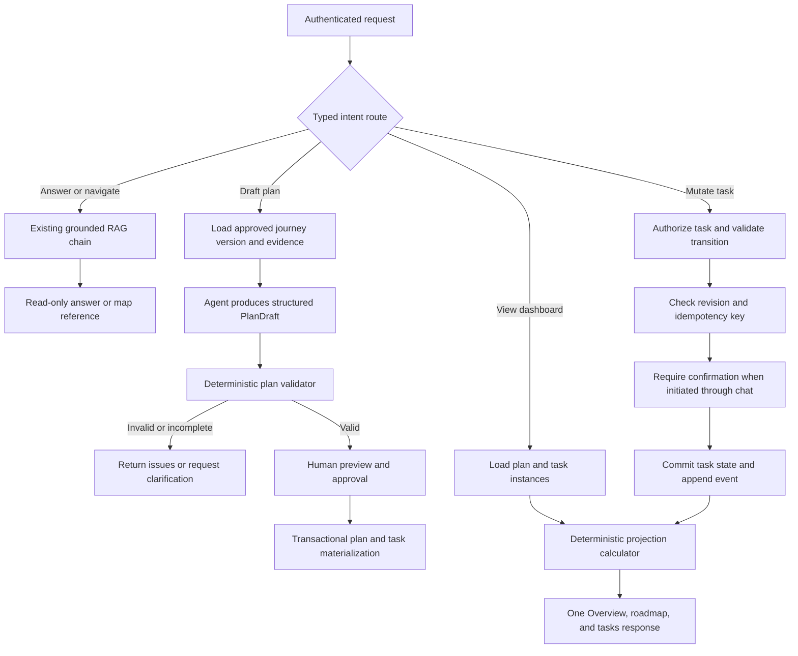

# Governed Onboarding Task, Progress, and Roadmap Spec

## Status

Proposed. Discussion and implementation planning only.

## Decision Summary

Use one governed onboarding agent with typed intent routing and deterministic application services.
The agent may answer questions, navigate knowledge, and propose a personalized onboarding plan. It
must not infer task completion, calculate progress through model output, or write learner state
directly.

Keep these responsibilities separate:

- the published knowledge map supplies reviewed onboarding content and evidence;
- a versioned journey definition supplies ordered roadmap stages and task definitions;
- a learner plan pins one journey-definition version;
- task instances and append-only task events record learner work;
- a deterministic server projection supplies progress, roadmap status, and task views; and
- chat sessions carry conversation and navigation context, not the durable learner plan.

This design deliberately avoids a multi-agent hierarchy, parallel task mutations, and a general
autonomous orchestrator. Those mechanisms are not justified by the current tool set or workflow.

## Interpretation and Assumptions

- "Process calculation" means the product's onboarding progress calculation.
- Progress is learner-specific and persists across chat sessions.
- Manual task completion is the initial supported completion rule.
- Due dates are optional and are never inferred from missing policy.
- Active plans remain pinned to their approved definition version until an explicit migration.
- The agent may prepare a state-changing command, but a chat-initiated mutation requires explicit
  user confirmation.

## Current Repository Findings

### Guide state is not learner progress

`GuideNode.status` currently means `generated` or `expanded`. The client maps an expanded guide node
to the presentation status `in-progress`, but this represents navigation or reveal state rather than
evidence that the learner completed work.

The published knowledge map is projected into guide state with every node initialized as
`generated`. It supplies useful content topology and source relationships, but it does not contain
learner-specific task IDs, assignments, due dates, completion rules, or mutation history.

### The current UI correctly refuses to infer missing data

The Tasks destination reports that task tracking is unavailable because the workspace contract does
not provide task IDs, due dates, or a completion mutation. Existing dashboard behavior likewise
keeps task and progress state unavailable instead of interpreting guide nodes as completed work.

This truthful boundary must be preserved when the features are connected.

### The current agent workflow is a governed chain

The Mastra workflow follows a stable sequence:

1. refine the input;
2. set the goal;
3. inspect context and evidence;
4. choose an approach;
5. build and validate a plan;
6. checkpoint for missing input or approval;
7. execute registered tools;
8. verify and synthesize the result.

The current planner selects between two read-only tools and constructs one phase. Although its
schemas allow a larger plan, current behavior is a Chain with checkpoints and a bounded execution
loop, not genuinely dynamic orchestration.

### Durable task state is absent

The application persists session settings, chat history, and guide JSON, but it has no separate
learner plan, task instance, or task event contract. The published knowledge map is loaded as a
request-time projection, so it is unsuitable as the mutable source of learner lifecycle state.

## Design Target

The completed workflow must support four typed intents:

| Intent                 | Outcome                                               | Authority                                                 |
| ---------------------- | ----------------------------------------------------- | --------------------------------------------------------- |
| `answer` or `navigate` | Grounded answer or authorized knowledge-map reference | Read-only agent workflow                                  |
| `draft_plan`           | Structured, evidence-backed plan proposal             | Agent proposal; no durable learner-state write            |
| `view_progress`        | Current task, roadmap, and progress projection        | Deterministic read service                                |
| `mutate_task`          | Validated task transition and recalculated projection | Transactional command service with confirmation and audit |

The agent remains responsible for interpreting natural language and producing grounded proposals.
Application services remain responsible for authorization, validation, persistence, calculation,
and auditability.

## Capability Assessment

| Function      | Weight | Required mechanism                                                                                                                                |
| ------------- | ------ | ------------------------------------------------------------------------------------------------------------------------------------------------- |
| Perception    | Heavy  | Retrieve authenticated actor, active plan, pinned definition, task state, dates, permissions, and authorized evidence into bounded typed context. |
| Memory        | Heavy  | Persist plan, task instances, revisions, definition version, and task events independently of chat history.                                       |
| Reasoning     | Heavy  | Produce a structured plan draft with explicit requirements, constraints, assumptions, and evidence references.                                    |
| Action        | Heavy  | Execute plan activation and task transitions only through transactional domain commands.                                                          |
| Reflection    | Heavy  | Apply schema validation, dependency validation, transition checks, calculation checks, and post-write verification.                               |
| Collaboration | Light  | Use a learner or manager approval handoff; do not add another agent.                                                                              |
| Governance    | Heavy  | Enforce ownership, roles, approvals, optimistic concurrency, idempotency, event history, and restricted tool access.                              |

## Topology Decision

### Primary topology: Route

Route the four intents to materially different handlers. On low-confidence or overlapping intent,
request clarification and perform no state change.

### Secondary topology: Chain

Each route uses stable ordered dependencies and explicit typed boundaries. The existing bounded
correction and retry behavior may remain for retrieval and provider failures. Progress calculation
and task projection do not use an AI loop.

### Rejected alternatives

- Multi-agent hierarchy: no current expertise, permission, or context boundary justifies its
  coordination cost.
- Parallel mutation: learner task state is shared and needs deterministic serialization.
- General autonomous orchestration: the current paths and tools are known and bounded.
- Guide-status reuse: navigation state cannot serve as completion evidence.

## Selected Patterns

| Function   | Pattern              | Input and output                                                                 | Owner and state boundary                       | Success, failure, and exit                                                                     |
| ---------- | -------------------- | -------------------------------------------------------------------------------- | ---------------------------------------------- | ---------------------------------------------------------------------------------------------- |
| Perception | Context triage       | Request, actor, and active state to a typed route and bounded context references | Request router; request-scoped state           | A single high-confidence route succeeds; ambiguity requests clarification with no write        |
| Memory     | Progress tracking    | Definition version and task events to durable plan/task state                    | Onboarding plan service; learner-plan scope    | Monotonic revisions and replayable state succeed; conflicts return reload/retry guidance       |
| Reasoning  | Structured reasoning | Goal and evidence to `PlanDraft`                                                 | Agent; draft scope                             | Schema-valid proposal succeeds; missing evidence or unresolved assumptions stop before preview |
| Action     | Guardrail sandwich   | Typed task command to committed transition and updated projection                | Task command service; one database transaction | Prechecks, commit, and postconditions pass; otherwise roll back or return a conflict           |
| Reflection | Generator-critic     | Agent draft to validation report                                                 | Agent generator plus deterministic validator   | Actionable findings cause one bounded revision; remaining findings go to the human             |
| Governance | Approval gate        | Draft activation or chat-requested mutation to approval receipt                  | Plan/task service; pending-action scope        | Valid fresh approval proceeds; rejection or expiry performs no write                           |
| Governance | Observability        | State transitions and references to immutable events and metrics                 | Audit/event writer; append-only event scope    | Every accepted mutation is reconstructable; audit failure blocks or reconciles per policy      |

## Execution Flow



## State Model

### `JourneyDefinitionVersion`

An immutable published definition of the onboarding journey. It may reference a published knowledge
map version but remains a separate lifecycle contract.

Required fields include:

- stable ID and version;
- title and optional description;
- publication state and timestamps;
- source knowledge-map version when applicable; and
- author, publisher, and access policy.

### `RoadmapStageDefinition`

An ordered stage belonging to one journey version:

- stable key and display position;
- title and description;
- optional knowledge-map node stable key;
- optional start/due-date policy;
- dependency keys; and
- source/evidence references.

### `TaskDefinition`

A task template belonging to a stage:

- stable key, title, and description;
- required/optional status;
- `countsTowardProgress`;
- positive progress weight, initially defaulting to `1`;
- completion rule, initially `manual`;
- optional due-date offset or explicit policy;
- dependency keys; and
- allowed completion authority.

### `OnboardingPlan`

A learner assignment pinned to one journey-definition version:

- plan ID, learner/owner ID, and optional originating session ID;
- definition version ID;
- `draft`, `active`, `completed`, or `cancelled` state;
- start and optional target dates;
- optimistic revision; and
- creation, activation, completion, and cancellation metadata.

The session may reference `activePlanId`, but the plan must not be embedded in session guide JSON.

### `TaskInstance`

A learner-specific instance materialized from a task definition:

- task and plan IDs;
- definition ID and stable key;
- `not_started`, `in_progress`, `blocked`, `completed`, or `waived` status;
- frozen due date when one can be calculated;
- completion or waiver metadata;
- optimistic revision; and
- current assignee and authority data.

`overdue` is derived when an incomplete task has `dueAt < asOf`; it is not stored as mutable truth.

### `TaskEvent`

An append-only record containing:

- task and plan IDs;
- prior and resulting state;
- actor ID and role;
- event time;
- source such as `tasks_ui`, `overview_ui`, `agent_confirmed`, or integration;
- client idempotency key;
- reason or evidence reference when required; and
- task/plan revision after the transition.

### `WorkspaceOnboardingProjection`

One server-produced read model supplies all task-related workspace surfaces:

```ts
interface WorkspaceOnboardingProjection {
  planId: string;
  planRevision: number;
  definitionVersionId: string;
  calculatedAt: string;
  progress: {
    percentComplete: number | null;
    completedWeight: number;
    totalWeight: number;
    currentStageId: string | null;
  };
  roadmap: RoadmapStageProjection[];
  tasks: TaskProjection[];
  upcomingTasks: TaskProjection[];
}
```

Overview, Roadmap, Upcoming Tasks, and the full Tasks destination must consume this same projection.

## Task Tracking Rules

Every state-changing request requires:

- a stable task-instance ID;
- an explicit target state;
- an expected task or plan revision;
- a client-generated idempotency key;
- current authorization and ownership;
- a valid state transition;
- satisfaction of the task's completion rule;
- a transaction that updates task state and appends one event; and
- a returned recalculated workspace projection.

Agent-specific rules:

- Conversation text alone never completes a task.
- A statement such as "I finished security training" may create a pending confirmation prompt.
- Only explicit confirmation or a direct completion control invokes the mutation.
- Waiver, reassignment, backdating, reopening, or deletion requires the corresponding product role
  and approval policy.
- A failed, denied, expired, or ambiguous command produces no learner-state change.

## Progress Calculation

Progress is a pure server-side function of the pinned journey version and current task instances.

```text
applicable tasks =
  tasks where countsTowardProgress = true
  and status != waived

earned weight =
  sum(weight for applicable tasks with status = completed)

total weight =
  sum(weight for all applicable tasks)

percent =
  total weight = 0
    ? unavailable
    : round(100 * earned weight / total weight)
```

The MVP gives no fractional credit for `in_progress`. Optional tasks affect progress only when their
definition explicitly sets `countsTowardProgress`.

A zero denominator returns unavailable progress, not `0%` or `100%`. The rendering layer may clamp
the display to `0-100` defensively, but an out-of-range contract must be logged as an invariant
failure.

## Roadmap Projection Rules

Roadmap stages come from the active plan's pinned stage definitions in stable definition order.
Arbitrary guide root nodes are not silently treated as lifecycle stages.

Stage status precedence is:

1. `completed` when every applicable required task is completed or waived;
2. `overdue` when incomplete and at least one incomplete task is past due;
3. `in-progress` when some work has started or the stage is the earliest dependency-unblocked
   incomplete stage;
4. `upcoming` otherwise; and
5. `status-unavailable` when the stage lacks a valid task lifecycle contract.

The current stage is the earliest incomplete, dependency-unblocked stage in stable order. A stage
projection includes its task counts, optional dates, knowledge-map reference, and authorized source
references.

A new journey publication never rewrites active plans silently. Version migration is explicit and
previews added, removed, retained, reset, and conflicting tasks before activation.

## Interfaces

The exact route names are an implementation choice, but the product needs these boundaries:

- get the current learner's unified onboarding projection;
- create a grounded plan draft;
- validate and preview a plan draft;
- approve and activate a valid plan;
- request a typed task transition;
- retrieve task-event history when authorized; and
- preview and approve a journey-version migration.

Controllers authenticate and parse requests, application services enforce domain behavior, and
repositories persist state. Neither UI components nor the model calculate authoritative progress.

## Governance

### Authority and approval

| Operation                                     | Default control                                         |
| --------------------------------------------- | ------------------------------------------------------- |
| Read authorized progress, tasks, and roadmap  | No additional approval                                  |
| Generate plan draft                           | No write and no approval                                |
| Activate learner plan                         | Explicit learner, manager, or policy-defined approval   |
| Complete own manual task from UI              | Explicit UI action; no second confirmation              |
| Complete task through chat                    | Explicit confirmation bound to task ID and target state |
| Waive, reassign, backdate, delete, or migrate | Elevated role and explicit approval                     |

### Blast-radius controls

- Row-level ownership and role checks apply on every read and write.
- Agent tools expose typed domain commands, not generic SQL, shell, URL, or filesystem access.
- Task writes affect one authorized task and plan transaction.
- Definition publication and learner progress use separate permissions.
- Access scope and actor authorization are refreshed before protected commands.
- Revision conflicts fail closed rather than overwriting concurrent state.

### Memory scope and retention

| State               | Subject and duration           | Retrieval and deletion rule                                                                              |
| ------------------- | ------------------------------ | -------------------------------------------------------------------------------------------------------- |
| Request context     | One actor and request          | Discard after response except bounded audit references                                                   |
| Agent draft         | One actor and proposed plan    | Retain until approval, rejection, expiry, or configured cleanup                                          |
| Plan and task state | One learner and plan lifecycle | Retrieve by ownership/role; correct through versioned commands and events; delete or anonymize by policy |
| Workflow snapshot   | One workflow run               | Existing authorized snapshot policy; do not use as task source of truth                                  |
| Journey definition  | Organization/version           | Admin-controlled retention; immutable published versions                                                 |

### Observability

Correlate task commands, events, projections, agent requests, plans, and approvals with request ID,
actor ID, plan ID, task ID, idempotency key, definition version, and revisions.

Alert on:

- unauthorized or cross-owner write attempts;
- duplicate transition signals;
- audit-event persistence failures;
- projection and event-replay mismatch;
- stale-revision spikes;
- calculation invariant failures;
- cyclic or unresolvable dependencies; and
- plan activations without a valid approval receipt.

## Failure and Recovery Behavior

- Ambiguous intent or task identity requests clarification and performs no write.
- Invalid transitions return a typed conflict without creating an event.
- Duplicate idempotency keys return the original mutation result.
- Stale revisions return the latest safe revision and require user reload/retry.
- Transaction failure rolls back both task state and task event.
- Projection failure after a committed event is recoverable by replay/recalculation and must alert.
- Source access revocation hides the source without rewriting valid task history.
- A new template version cannot partially migrate an active plan.
- An agent/provider failure cannot bypass deterministic validation or approval.

## Evaluation Plan

### Representative scenarios

1. A learner views an active roadmap and sees the same task state on Overview and Tasks.
2. Completing a task updates progress, roadmap status, Upcoming Tasks, and Tasks in one response.
3. Completing the same task twice with the same idempotency key creates one event.
4. A second device submits a stale revision and receives a conflict without overwriting newer state.
5. The agent produces a grounded draft, validation identifies an invalid dependency, and no plan is
   activated.
6. The learner approves a valid draft and receives materialized tasks pinned to the approved
   definition version.
7. A newer journey version is published while the learner continues on the unchanged active plan.
8. A manager previews a version migration and sees added, removed, retained, and conflicting tasks.

### Adversarial and edge cases

- Another learner attempts to read or mutate a known task ID.
- Source text instructs the agent to mark onboarding complete.
- Chat text falsely claims that every task is complete.
- A stage or task dependency graph contains a cycle.
- A plan contains no eligible progress-bearing tasks.
- A task is waived after partial plan completion.
- Due dates cross a timezone or daylight-saving transition.
- Source authorization changes between plan drafting and activation.
- An approval expires or belongs to a different plan revision.
- Event persistence succeeds but projection refresh temporarily fails.

### Required metrics and thresholds

- zero unauthorized writes;
- zero duplicate transition events for one idempotency key;
- zero cross-surface projection mismatches;
- deterministic replay of every displayed progress value;
- zero plan activations without valid approval;
- task-mutation success and conflict rates;
- draft validation, approval, rejection, and human-edit rates;
- progress-projection latency; and
- stale-revision, recovery, and invariant-failure counts.

## Delivery Roadmap

### Phase 1: Contract foundation

Finalize lifecycle states, completion authority, waiver behavior, progress weights, due-date policy,
dependency semantics, and version-migration policy.

### Phase 2: Read-only lifecycle projection

Introduce durable plan/task state and the unified deterministic projection. Connect Overview,
Roadmap, Upcoming Tasks, and Tasks without enabling completion mutations.

### Phase 3: Manual task completion

Add revisioned, idempotent transitions, event history, optimistic UI rollback, error announcements,
and deterministic progress refresh.

### Phase 4: Agent-assisted plan drafting

Add evidence-backed `PlanDraft`, deterministic validation, preview, approval, and transactional plan
materialization.

### Phase 5: Governed expansion

Add verified completion rules, manager assignment, reminders, external-system adapters, and explicit
plan-version migration only after the MVP metrics demonstrate the need.

### Scaling triggers

- Add dynamic orchestration only when plan dependencies change at runtime and static routes fail.
- Add parallelism only for independent read work with deterministic merge behavior.
- Add a specialist agent only when context, tools, expertise, or permissions must be isolated.
- Add durable agent memory beyond plan/task state only when cross-run context loss measurably harms
  outcomes and retention/correction/deletion rules are defined.

## Implementation To-Do List

### Product and domain decisions

- [x] Confirm that progress is task-weight based rather than stage-count based.
- [x] Confirm whether optional tasks count toward progress by default.
- [x] Confirm whether a waived task is removed from the denominator or counted as satisfied.
- [ ] Define who may activate, waive, reassign, reopen, backdate, cancel, and migrate plans/tasks.
- [x] Define manual, verified, and external completion rules; scope the MVP to manual completion.
- [x] Define due-date offsets, timezone handling, and behavior when no due-date policy exists.
- [x] Define task and stage dependency semantics.
- [ ] Define active-plan migration policy for new journey versions.
- [ ] Define retention, anonymization, and deletion policy for plans, events, drafts, and approvals.

### Shared contracts

- [x] Add journey-definition, stage-definition, task-definition, learner-plan, task-instance, and
      task-event contracts.
- [x] Add the unified `WorkspaceOnboardingProjection` contract.
- [ ] Add typed task-transition, plan-draft, validation-result, approval, and migration-preview
      contracts.
- [x] Keep guide navigation status separate from learner lifecycle status.
- [x] Define explicit unavailable, empty, partial, unauthorized, conflict, and error states.

### Persistence

- [x] Add versioned journey-definition storage.
- [x] Add ordered stage and task definitions with stable keys and dependency validation.
- [x] Add learner plans pinned to immutable journey versions.
- [x] Add task instances with due dates, revisions, and completion metadata.
- [x] Add append-only task events with unique idempotency keys.
- [ ] Add approval receipts or equivalent durable approval evidence.
- [x] Add indexes and ownership constraints for plan, task, and event queries.
- [ ] Define transactional materialization and migration behavior.

### Server domain services

- [ ] Add a plan draft validator with schema, access, source, date, stable-key, and dependency checks.
- [x] Add transactional plan activation and task materialization.
- [x] Add task transition validation, authorization, revision checking, and idempotency handling.
- [x] Add the pure progress and roadmap projection calculator.
- [ ] Add event replay/reconciliation and projection invariant checks.
- [ ] Add explicit plan-version migration preview and activation.
- [x] Ensure controllers remain thin and repositories remain behind application services.

### Agent workflow

- [ ] Route `answer`, `navigate`, `draft_plan`, `view_progress`, and `mutate_task` explicitly.
- [x] Preserve the current grounded read-only path for answers and navigation.
- [ ] Define a bounded, evidence-backed `PlanDraft` output schema.
- [ ] Run deterministic validation after agent draft generation.
- [ ] Permit at most one bounded automatic draft revision before human handoff.
- [ ] Require explicit confirmation for every chat-initiated task mutation.
- [ ] Expose only typed plan/task tools; do not expose generic data or execution tools.
- [x] Keep progress calculation and roadmap projection outside the model workflow.

### API and authorization

- [x] Add a unified authenticated onboarding projection read boundary.
- [ ] Add plan-draft generation, validation, preview, approval, and activation boundaries.
- [x] Add a typed task-transition boundary with expected revision and idempotency key.
- [ ] Add authorized event-history and migration-preview boundaries.
- [ ] Reauthorize on plan activation, task mutation, approval use, and migration.
- [x] Return typed conflict and original-idempotent-result responses.

### Workspace UI

- [x] Connect Overview, Roadmap, Upcoming Tasks, and Tasks to the same projection.
- [x] Render roadmap stage statuses only from the lifecycle projection.
- [x] Render overdue as derived status and show dates only when provided.
- [x] Add real completion controls only when the mutation contract is available.
- [ ] Add pending, disabled, success, conflict, rollback, and announced error states.
- [x] Preserve source authorization and safe-link handling.
- [ ] Add plan preview, validation findings, and approval UI before activation.
- [ ] Add chat mutation confirmation bound to a specific task ID, target state, and revision.
- [x] Preserve honest empty/unavailable states when no active plan exists.

### Governance and observability

- [ ] Add immutable audit events for draft, validation, approval, activation, task transition,
      conflict, waiver, migration, and reconciliation.
- [ ] Correlate requests, plans, tasks, events, approvals, workflow runs, and definition versions.
- [ ] Redact prompts, credentials, sensitive source bodies, and unrelated personal data.
- [ ] Alert on unauthorized writes, duplicate events, projection mismatch, audit failure, and invalid
      calculation output.
- [ ] Document operational recovery for committed event plus failed projection refresh.

### Verification

- [x] Unit-test progress weights, waiver behavior, zero denominator, stage status precedence, current
      stage selection, due dates, and dependencies.
- [ ] Unit-test every allowed and rejected task-state transition.
- [ ] Test plan-draft validation and bounded revision behavior.
- [ ] Integration-test authorization, optimistic concurrency, idempotency, transaction rollback,
      event replay, and approval binding.
- [ ] End-to-end test cross-surface consistency after task completion.
- [ ] Test prompt injection and false chat completion claims.
- [ ] Test source-scope removal between draft and activation.
- [ ] Test active-plan stability after publication of a new journey version.
- [ ] Test migration preview and all-or-nothing migration activation.
- [ ] Verify accessibility for statuses, controls, confirmation, errors, dates, and progress output.
- [ ] Run lint, tests, build, formatting, and desktop/mobile visual QA.

## Acceptance Criteria

- Guide navigation state is never used as task completion evidence.
- The agent may propose a plan but cannot activate it without deterministic validation and approval.
- Chat content alone cannot mutate a task.
- Task transitions are authorized, revisioned, idempotent, transactional, and auditable.
- Progress is reproducible from the pinned plan definition and task-event state.
- Overview, Roadmap, Upcoming Tasks, and Tasks show one consistent projection.
- Roadmap stages use stable product-defined order and lifecycle-derived status.
- Due dates and overdue states appear only when a real date policy supplies them.
- Active plans do not change when a new journey version is published.
- Empty and unavailable lifecycle states remain truthful.
- No multi-agent, parallel mutation, or dynamic orchestration is added without its stated scaling
  trigger being observed.

## Architecture Review

- Every Heavy cognitive function has an explicit, testable, observable, and recoverable mechanism.
- Every selected pattern solves a named failure in this workflow.
- Route owns intent selection; Chain owns each selected path.
- Memory is scoped by learner/plan, duration, retrieval authorization, correction method, and
  deletion policy.
- No parallel write path exists, so shared-state merge conflicts are avoided.
- Agent revision and provider retries are bounded and have human or safe-failure exits.
- Approval, authority, audit, and blast radius are proportional to the state-changing operations.
- The first version remains one agent plus deterministic domain services; additional agents and
  orchestration are future extensions, not MVP dependencies.
