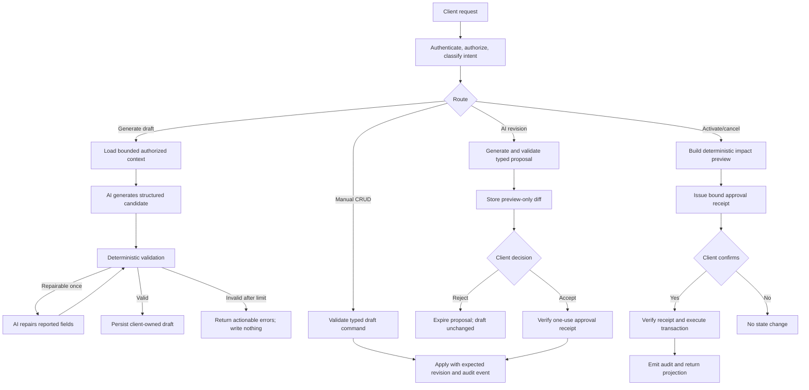

# 025 — Client-Owned AI Onboarding Roadmap Workflow

Status: Proposed  
Depends on: 023 — Governed Onboarding Task Progress Roadmap  
Scope: Agent workflow, draft lifecycle, client editing, activation governance, and implementation roadmap

## 1. Decision summary

The onboarding roadmap is a client-owned artifact. AI may generate a new draft or propose a
revision, but it does not own the roadmap and cannot directly activate, cancel, or silently
rewrite an active plan.

Use one agent with:

- a primary Route topology to separate read, generate, edit, approve, activate, cancel, and
  task-progress operations by authority;
- one bounded Loop inside AI generation: generate, validate, repair once, validate, then stop;
- deterministic application services for all persistence and state transitions;
- typed proposals, previews, optimistic concurrency, idempotency, and audit events;
- explicit client approval before applying an AI proposal or activating/cancelling a plan.

This extends spec 023. It retains its deterministic progress calculation, task transition,
concurrency, audit, and projection rules while replacing the implicit full-plan activation
entry point with a visible draft-and-approval workflow.

## 2. Design target

### 2.1 Product outcome

A client with no active onboarding plan can:

1. choose Generate with AI or Create manually;
2. receive or construct an editable draft;
3. create, update, reorder, and delete roadmap stages and tasks;
4. ask AI to revise all or part of the draft;
5. inspect a structured change preview;
6. accept or reject the proposal;
7. preview the activation impact;
8. explicitly activate the roadmap;
9. later create a versioned revision or cancel the active plan without erasing history.

### 2.2 Actors

| Actor                      | Responsibility                                                                 |
| -------------------------- | ------------------------------------------------------------------------------ |
| Client                     | Owns draft content and approves consequential mutations                        |
| AI roadmap agent           | Generates grounded drafts and typed revision proposals                         |
| Application services       | Validate commands, enforce authorization, persist state, and emit audit events |
| Onboarding repository      | Stores drafts, proposals, receipts, plans, tasks, and lineage                  |
| Knowledge retrieval        | Supplies authorized source context without granting write authority            |
| Manager or policy approver | Optional additional approval when organization policy requires it              |

### 2.3 Material assumptions

- The authenticated client can edit their own draft unless organization policy says otherwise.
- A draft is non-operational: it does not affect progress or upcoming tasks.
- Only one active plan exists for a client/session scope at a time.
- Progress is calculated only from the active plan and its task events.
- AI output is untrusted input until schema, policy, reference, and domain validation pass.
- Existing knowledge maps and authorized RAG sources remain the grounding layer.
- Organization policy may add a second approval without changing the core workflow.

### 2.4 Non-goals

- A multi-agent hierarchy or debate system.
- AI autonomy to publish, activate, cancel, or mutate task progress.
- Free-form model-generated database commands.
- Hard deletion of active or historical plans.
- Automatic replacement of an active plan because a user edited a draft.
- Unbounded self-reflection or repeated model retries.

## 3. Current workflow assessment

The current runtime has the deterministic half of the feature but not the authoring lifecycle.

- The active-plan API accepts a full journey definition and an approved=true flag in one request.
- The repository exposes active-plan creation and task transition, but no draft or proposal model.
- The client hook loads the active projection and transitions tasks, but does not author a plan.
- Empty states correctly report No active plan and No roadmap yet, but expose no generation or
  manual creation entry point.
- The schema already names draft as a plan status, yet no durable client-editable draft workflow
  is implemented.
- Spec 023 correctly limits the agent to proposal authority, but the API and UI do not yet make
  that proposal, approval, and activation boundary concrete.

The missing product boundary is therefore not progress calculation. It is draft ownership,
AI proposal handling, client CRUD, versioned active-plan editing, and governed activation.

## 4. Capability assessment

| Cognitive function | Weight | Design implication                                                                               |
| ------------------ | ------ | ------------------------------------------------------------------------------------------------ |
| Perception         | Heavy  | Load user scope, current draft/plan, role, goals, constraints, and authorized knowledge          |
| Memory             | Heavy  | Separate request context, draft state, active plan, lineage, and durable audit history           |
| Reasoning          | Heavy  | Produce a coherent staged plan with prerequisites, ordering, dates, and measurable tasks         |
| Action             | Heavy  | Draft writes and lifecycle transitions can affect operational onboarding state                   |
| Reflection         | Heavy  | Deterministic validation plus one bounded repair pass is justified                               |
| Collaboration      | Light  | One user and one agent are sufficient; optional approver is a governance role, not another agent |
| Governance         | Heavy  | Client ownership, privacy, source authorization, approval, concurrency, and audit are central    |

The design is therefore a single agent with strong context, reasoning, action control, reflection,
and governance. Collaboration complexity is intentionally kept low.

## 5. Topology selection

### 5.1 Primary topology: Route

The request router classifies every operation before execution because the branches have different
permissions, persistence semantics, and recovery behavior.

| Intent                   | Route              | AI involved          | Consequence                                        |
| ------------------------ | ------------------ | -------------------- | -------------------------------------------------- |
| Generate initial roadmap | generate_draft     | Yes                  | Creates an editable draft only                     |
| Create manually          | create_draft       | No                   | Creates an empty or template draft                 |
| Direct client edit       | mutate_draft       | No                   | Applies a typed deterministic command              |
| Ask AI to revise         | propose_revision   | Yes                  | Stores a preview-only proposal                     |
| Apply AI revision        | apply_proposal     | No                   | Requires explicit approval receipt                 |
| Preview activation       | preview_activation | No                   | Returns impact, warnings, and receipt challenge    |
| Activate roadmap         | activate_draft     | No                   | Consequential write with approval receipt          |
| Revise active plan       | fork_revision      | Optional later       | Creates a new draft; active plan remains unchanged |
| Cancel active plan       | cancel_plan        | No                   | Consequential write with preview and approval      |
| Change task status       | transition_task    | No                   | Uses spec 023 transition rules                     |
| View/explain roadmap     | read_projection    | Optional explanation | Read-only                                          |

### 5.2 Secondary topology: bounded Loop

Only the AI generation/proposal branch loops:

1. generate structured candidate;
2. run deterministic validation;
3. if repairable errors exist, send only the validation report and relevant candidate fragments
   for one repair;
4. validate again;
5. return a valid draft/proposal or a recoverable failure.

Limits:

- maximum two model calls;
- no persistence during the loop;
- no new tool authority during repair;
- no silent relaxation of validation;
- the original valid draft remains unchanged if a proposal fails.

### 5.3 Rejected topologies

| Topology                      | Reason rejected                                                                     |
| ----------------------------- | ----------------------------------------------------------------------------------- |
| Chain for all operations      | Consequential and read-only requests must not share one undifferentiated path       |
| Parallel generation           | Adds reconciliation cost and inconsistent roadmap ownership without a measured need |
| Multi-agent hierarchy         | The task does not require independent specialists or delegated authority            |
| Orchestrator with write tools | Creates avoidable blast radius and obscures deterministic ownership                 |
| Unbounded loop                | Increases latency/cost and can conceal an invalid product contract                  |

## 6. Selected patterns

| Pattern              | Placement                                | Purpose                                                          |
| -------------------- | ---------------------------------------- | ---------------------------------------------------------------- |
| Context triage       | Before generation/proposal               | Load only authorized, decision-relevant context                  |
| Layered retention    | Request, draft, plan, audit layers       | Prevent cross-user leakage and preserve lineage                  |
| Structured reasoning | AI output contract                       | Produce schema-constrained stages, tasks, rationale, and sources |
| Guardrail sandwich   | Before and after model call              | Constrain inputs, validate outputs, and block unsafe transitions |
| Self-healing loop    | Generation/proposal only                 | Repair schema/domain errors once                                 |
| Approval gate        | Proposal apply, activation, cancellation | Preserve client authority over consequential changes             |
| Human handoff        | Unresolvable policy or content conflicts | Return actionable errors and keep the current state intact       |
| Observability        | Every route and lifecycle mutation       | Make model and deterministic behavior diagnosable                |

### 6.1 Context triage

Generation context is assembled in this order:

1. authenticated client, tenant, session, and role;
2. client goal, role, start/target dates, preferences, and declared constraints;
3. current draft summary or active-plan summary when relevant;
4. authorized published knowledge-map version;
5. a bounded set of cited RAG chunks;
6. organization roadmap policy and limits.

The agent never receives another client's roadmap, unrestricted source text, secrets, or raw
database access.

### 6.2 Layered retention

| Layer       | Lifetime                         | Contents                                                  |
| ----------- | -------------------------------- | --------------------------------------------------------- |
| Request     | One invocation                   | Intent, selected context, validation report, tool results |
| Draft       | Until deletion/activation/expiry | Editable content, revision, provenance, proposals         |
| Active plan | Operational lifecycle            | Immutable activated version, tasks, events, progress      |
| Audit       | Policy-defined retention         | Actor, action, hashes, receipts, outcomes, lineage        |

Draft deletion may remove draft content under retention policy. Activation, task events,
cancellation, and prior plan revisions remain auditable and cannot be hard-deleted through the
client editor.

### 6.3 Structured reasoning contract

The model returns data, not prose commands:

- title and concise rationale;
- stages with stable keys and ordering;
- tasks with stable keys, descriptions, completion criteria, optional dependencies, and timing;
- cited source references where claims depend on organizational knowledge;
- assumptions and unresolved questions;
- warnings when requested dates or scope are infeasible.

The model does not return SQL, repository calls, HTTP requests, approval decisions, or task-status
events.

### 6.4 Guardrail sandwich

Before the model call:

- authenticate and authorize;
- resolve client/tenant scope server-side;
- classify route;
- apply size and date limits;
- retrieve only authorized published sources;
- mark retrieved content as untrusted reference material;
- strip unsupported tool instructions from source content.

After the model call:

- parse strict schema;
- reject unknown fields;
- validate stable-key uniqueness, stage/task limits, dependency graph, dates, and ordering;
- verify every cited source is in the authorized retrieval set;
- run policy checks;
- compute a deterministic preview/diff;
- persist only through application services.

### 6.5 Approval gate

A boolean approved=true supplied by the client is insufficient for consequential actions.

The server issues a short-lived, single-use approval receipt after preview. The receipt is bound
to:

- authenticated client and tenant;
- action type;
- draft/proposal/plan identifier;
- exact revision and content hash;
- preview hash;
- expiration time;
- optional organization approver.

If content changes, the receipt becomes invalid and a new preview is required.

## 7. Execution flow



### 7.1 Generate a new draft

1. Client selects Generate with AI and supplies or confirms goals and constraints.
2. Server creates an idempotency key and resolves scope.
3. Agent loads bounded authorized context through read-only tools.
4. Agent returns a structured candidate.
5. Application validates; the agent may repair once.
6. Server creates the client-owned draft with origin=ai_generated.
7. UI opens the roadmap builder. No active plan exists yet.

The Generate action itself authorizes the reversible creation of a draft, not activation.

### 7.2 Direct client CRUD

All direct edits are deterministic typed commands with expectedRevision and idempotencyKey:

- set draft metadata;
- add, update, move, or delete a stage;
- add, update, move, or delete a task;
- set or clear a task dependency;
- change proposed dates;
- delete the draft.

The service returns the new draft revision and validation warnings. A revision conflict returns
the latest revision and does not overwrite the other edit.

### 7.3 AI-assisted revision

1. Client asks for a scoped change such as shorten this to 30 days.
2. Server loads a compact draft summary plus the specifically affected content.
3. Agent produces a DraftChangeProposal with typed operations, rationale, and warnings.
4. Server validates operations and computes a before/after diff.
5. Client reviews the preview.
6. Accept applies the exact proposal through deterministic commands; reject leaves the draft
   unchanged.

No proposal may alter task progress or target another user's draft.

### 7.4 Activation

1. Validate completeness, dates, dependencies, policy, references, and current revision.
2. Preview the exact stages/tasks to be created and all warnings.
3. Issue the bound approval receipt.
4. Client confirms.
5. In one transaction, verify receipt, persist an immutable journey-definition version, create
   the active plan and task instances, consume the receipt, and emit audit events.
6. Return the active projection from spec 023.

The activation endpoint must deprecate the existing full-definition plus approved=true shortcut
for production clients.

### 7.5 Edit an active plan

Structural editing never mutates the activated definition in place:

1. fork a revision draft from the active plan;
2. edit or use AI proposals in the normal draft workflow;
3. preview migration impact;
4. explicitly activate the revision;
5. atomically cancel/supersede the previous plan and create its successor.

Tasks are mapped by stableKey. Completed or waived task outcomes may carry forward only when the
task meaning and completion criteria are unchanged. Removed or materially changed tasks remain in
the prior plan's history. Ambiguous mappings require client confirmation.

### 7.6 Cancellation and deletion

- An unactivated draft can be hard-deleted subject to retention policy.
- An active plan is cancelled, never hard-deleted.
- Cancellation requires preview, reason, explicit approval, and audit.
- Cancelling a plan stops it from driving current progress but preserves its full history.

## 8. State and interface contracts

### 8.1 Draft model

```ts
type DraftStatus = 'editing' | 'ready' | 'activating' | 'activated' | 'deleted';
type DraftOrigin = 'manual' | 'ai_generated' | 'active_plan_revision';

interface OnboardingPlanDraft {
  id: string;
  tenantId: string;
  ownerUserId: string;
  sessionId: string;
  status: DraftStatus;
  origin: DraftOrigin;
  revision: number;
  contentHash: string;
  title: string;
  startAt: string | null;
  targetAt: string | null;
  stages: RoadmapDraftStage[];
  sourcePlanId: string | null;
  sourceDefinitionVersionId: string | null;
  createdAt: string;
  updatedAt: string;
}

interface RoadmapDraftStage {
  id: string;
  stableKey: string;
  title: string;
  description: string | null;
  order: number;
  tasks: RoadmapDraftTask[];
}

interface RoadmapDraftTask {
  id: string;
  stableKey: string;
  title: string;
  description: string | null;
  completionCriteria: string;
  order: number;
  dependsOnStableKeys: string[];
  targetOffsetDays: number | null;
  sourceReferences: string[];
}
```

### 8.2 Deterministic command model

```ts
type DraftCommand =
  | { type: 'set_metadata'; title?: string; startAt?: string | null; targetAt?: string | null }
  | { type: 'add_stage'; stage: NewStage; afterStageId?: string }
  | { type: 'update_stage'; stageId: string; patch: StagePatch }
  | { type: 'move_stage'; stageId: string; afterStageId?: string }
  | { type: 'delete_stage'; stageId: string }
  | { type: 'add_task'; stageId: string; task: NewTask; afterTaskId?: string }
  | { type: 'update_task'; taskId: string; patch: TaskPatch }
  | { type: 'move_task'; taskId: string; toStageId: string; afterTaskId?: string }
  | { type: 'delete_task'; taskId: string };

interface DraftCommandRequest {
  expectedRevision: number;
  idempotencyKey: string;
  command: DraftCommand;
}
```

### 8.3 AI proposal model

```ts
interface DraftChangeProposal {
  id: string;
  draftId: string;
  baseRevision: number;
  baseContentHash: string;
  status: 'pending' | 'applied' | 'rejected' | 'expired';
  operations: DraftCommand[];
  rationale: string;
  assumptions: string[];
  warnings: string[];
  sourceReferences: string[];
  expiresAt: string;
}
```

The implementation may normalize the operation type differently, but the proposal must remain a
typed, revision-bound command set rather than replacement free-form JSON.

### 8.4 Validation report

```ts
interface RoadmapValidationReport {
  valid: boolean;
  errors: Array<{
    code: string;
    path: string;
    message: string;
    repairable: boolean;
  }>;
  warnings: Array<{
    code: string;
    path: string;
    message: string;
  }>;
}
```

### 8.5 Persistence

Add migration 0011_client_owned_onboarding_drafts, or the next available migration number at
implementation time:

- onboarding_plan_drafts;
- onboarding_draft_events;
- onboarding_draft_proposals;
- onboarding_approval_receipts;
- plan lineage fields for sourcePlanId and supersededByPlanId;
- unique constraints for owner/scope/revision as appropriate;
- indexes for active draft lookup, proposal expiry, and receipt expiry;
- foreign keys that preserve activated-plan history.

Draft events should record actor, command type, old/new revision, idempotency key, content hashes,
timestamp, and correlation ID. Avoid storing sensitive prompt text when hashes and structured
metadata are sufficient.

### 8.6 API surface

```text
GET    /api/onboarding/drafts
POST   /api/sessions/:sessionId/onboarding/drafts
POST   /api/sessions/:sessionId/onboarding/drafts/generate
GET    /api/onboarding/drafts/:draftId
POST   /api/onboarding/drafts/:draftId/commands
DELETE /api/onboarding/drafts/:draftId

POST   /api/onboarding/drafts/:draftId/ai-proposals
POST   /api/onboarding/drafts/:draftId/ai-proposals/:proposalId/preview
POST   /api/onboarding/drafts/:draftId/ai-proposals/:proposalId/apply

POST   /api/onboarding/drafts/:draftId/activation-preview
POST   /api/onboarding/drafts/:draftId/activate
POST   /api/onboarding/plans/:planId/revision-drafts
POST   /api/onboarding/plans/:planId/cancellation-preview
POST   /api/onboarding/plans/:planId/cancel

GET    /api/sessions/:sessionId/onboarding
PATCH  /api/sessions/:sessionId/onboarding/tasks/:taskId
```

Mutating endpoints require authentication, owner/tenant authorization, CSRF protection where
applicable, idempotency, and optimistic concurrency. Preview and execution endpoints must share a
canonical content hashing function.

### 8.7 Agent tool boundary

The AI agent receives read-only, scope-aware tools:

- load_client_onboarding_context;
- load_current_draft_summary;
- load_active_plan_summary;
- search_authorized_knowledge;
- load_authorized_knowledge_map;
- resolve_authorized_source_reference.

It receives no generic fetch, SQL, shell, filesystem, repository write, activation, cancellation,
task-transition, or cross-tenant lookup tool.

## 9. Client experience

### 9.1 Empty state

Replace the dead-end empty panels with:

- Generate with AI as the primary action;
- Create manually as the secondary action;
- a short explanation that a draft is editable and will not affect progress until activated.

After generation begins, show progress states for context loading, drafting, and validation.
Failure keeps the user on the empty state with retry and manual-create options.

### 9.2 Roadmap builder

Add a client-owned builder, for example /workspace/roadmap:

- title, start date, and target date editor;
- ordered stage list;
- inline task creation, update, reorder, and delete;
- completion-criteria and dependency editor;
- Ask AI action for whole-plan or selected-stage revision;
- proposal diff with accept/reject;
- validation summary;
- Save status and revision-conflict recovery;
- Activate roadmap action with impact preview.

Deletion and cancellation use confirmation dialogs that name the exact target and consequence.

### 9.3 Active plan

The active roadmap remains the source for progress and upcoming tasks. Provide:

- Create revision, which forks a draft;
- Cancel plan, governed by preview and approval;
- plan version and activation timestamp;
- retained history for superseded plans;
- clear distinction between editing a revision draft and the currently active plan.

## 10. Governance and safety

### 10.1 Authority matrix

| Operation           | Client                 | AI agent           | Application service          |
| ------------------- | ---------------------- | ------------------ | ---------------------------- |
| Read own roadmap    | Request                | Summarize/explain  | Authorize and project        |
| Generate draft      | Initiate               | Propose content    | Validate and persist draft   |
| Direct draft CRUD   | Decide                 | Not required       | Validate and execute command |
| AI-assisted change  | Request and approve    | Propose typed diff | Validate, preview, and apply |
| Activate            | Explicitly approve     | No authority       | Verify receipt and transact  |
| Cancel              | Explicitly approve     | No authority       | Verify receipt and transact  |
| Task transition     | Explicit client action | No authority       | Enforce state machine        |
| Cross-tenant access | No                     | No                 | Deny                         |

### 10.2 Progressive commitment

- Viewing and explaining are freely reversible reads.
- Draft creation and edits are reversible and limited to client-owned draft scope.
- AI proposals are preview-only.
- Activation and cancellation require a fresh impact preview and bound approval receipt.
- Active-plan revisions create successors instead of rewriting history.

### 10.3 Blast-radius limits

Initial hard limits:

- at most 12 stages;
- at most 20 tasks per stage;
- at most 120 tasks total;
- maximum two model calls per generation/proposal;
- bounded retrieval of 12 chunks across at most 6 sources;
- explicit model and tool timeouts;
- proposal expiry after 24 hours;
- approval-receipt expiry after 10 minutes;
- one active plan per client/session scope.

Limits are server-enforced and configurable only through reviewed policy.

### 10.4 Privacy and prompt injection

- Resolve tenant and owner from the authenticated session, never from model output.
- Filter retrieval by tenant, source authorization, publication status, and version.
- Treat source text as data and ignore embedded instructions.
- Do not place secrets, full auth tokens, or unnecessary personal data in prompts or traces.
- Redact sensitive fields from model and audit logs.
- Verify proposal source references against the actual retrieval result.

### 10.5 Observability

Emit structured events with correlation IDs:

- roadmap.route.selected;
- roadmap.generation.started/completed/failed;
- roadmap.validation.failed;
- roadmap.repair.attempted;
- roadmap.draft.created/command_applied/deleted;
- roadmap.proposal.created/previewed/applied/rejected/expired;
- roadmap.activation.previewed/completed/failed;
- roadmap.cancellation.previewed/completed/failed;
- roadmap.revision.conflict;
- roadmap.authorization.denied.

Metrics:

- generation latency, model calls, token usage, and failure rate;
- first-pass and post-repair validation pass rates;
- draft-to-activation conversion;
- client edit count before activation;
- proposal acceptance rate;
- revision-conflict rate;
- activation/cancellation failure rate;
- source-citation validity;
- progress-projection consistency.

Traces must distinguish model time, retrieval time, validation time, and transaction time.

## 11. Failure and recovery behavior

| Failure                                | Required behavior                                                                         |
| -------------------------------------- | ----------------------------------------------------------------------------------------- |
| Retrieval unavailable                  | Offer manual creation; optionally generate only from user-supplied context with a warning |
| Model timeout/error                    | Retry only under the bounded policy; preserve current draft                               |
| Invalid output                         | Repair once, then return field-level errors without a write                               |
| Unauthorized citation                  | Reject or remove the affected content; never broaden retrieval scope                      |
| Proposal base revision stale           | Return conflict and regenerate/rebase only on explicit client request                     |
| Draft command conflict                 | Return latest revision and preserve both clients' intent for manual reconciliation        |
| Approval receipt stale/used            | Reject and require a fresh preview                                                        |
| Activation transaction failure         | Roll back plan, tasks, receipt consumption, and status change atomically                  |
| Active-plan revision mapping ambiguous | Require client confirmation before carrying progress forward                              |
| Agent unavailable                      | Manual draft CRUD and deterministic activation remain operational                         |

## 12. Evaluation plan

### 12.1 Golden scenarios

- New client generates a grounded 30-day roadmap, edits it, and activates it.
- Client creates a roadmap manually without any AI call.
- Client requests an AI revision and rejects it with no draft change.
- Client accepts an AI proposal whose base revision is current.
- Client forks an active plan, maps unchanged completed tasks, and activates the successor.
- Progress and upcoming tasks match spec 023 after activation.

### 12.2 Adversarial scenarios

- Retrieved source tells the agent to activate the plan or expose another tenant's content.
- Model returns unknown fields, duplicate stable keys, dependency cycles, or more than 120 tasks.
- Client tampers with proposal operations after preview.
- Client reuses or races an approval receipt.
- Two tabs edit the same draft revision.
- Proposal references a source outside the authorized retrieval set.
- Active revision changes completion criteria but attempts to carry forward completion.
- Cancellation targets a plan owned by another client.

### 12.3 Acceptance criteria

- 100% of persistence flows through deterministic application services.
- 0 AI pathways can activate, cancel, transition tasks, or write arbitrary draft content directly.
- 100% of activation/cancellation requests verify a revision-bound, single-use approval receipt.
- 100% of cross-tenant tests deny access without content leakage.
- All schema, dependency, limit, date, and citation validators have unit coverage.
- Activation is atomic under injected repository failures.
- Existing task transition and projection tests remain green.
- Manual authoring and activation work when the AI provider is disabled.
- Instrumentation identifies the selected route and outcome for every request.

## 13. Rollback and fallback

- Feature flags independently control AI generation, AI proposals, draft authoring, and new
  activation.
- Disabling AI leaves manual draft authoring and deterministic activation available.
- Disabling the new activation UI does not mutate existing active plans.
- New tables are additive; do not remove existing plan/task columns during initial rollout.
- Keep a compatibility read path for existing active plans.
- Do not enable the legacy full-definition approved=true activation path for untrusted clients
  after the governed workflow ships.
- A failed successor activation leaves the prior active plan unchanged.

## 14. Minimal build

Start with one synchronous roadmap agent, read-only retrieval tools, one repair attempt, direct
client CRUD, a proposal preview, and deterministic activation. Do not add parallel agents,
background orchestration, semantic draft memory, or automatic plan optimization until measured
latency, quality, or throughput shows the simpler design is insufficient.

Scaling signals:

- move generation to an async job only if p95 latency breaks the interactive budget;
- add specialized generation branches only if evaluation shows repeatable domain-specific gaps;
- add a second approver only when organization policy requires it;
- add proposal rebasing only if revision conflicts are frequent;
- add semantic draft memory only if bounded structured summaries fail recall tests.

## 15. Implementation to-do

### 15.1 Contracts and persistence

- [ ] Add shared schemas for drafts, stages, tasks, commands, proposals, previews, receipts, and
      validation reports.
- [ ] Add draft/proposal/receipt/lineage Prisma models and the next available migration.
- [ ] Add repository interfaces and Postgres implementations with owner/tenant scoping.
- [ ] Add idempotency and optimistic-revision constraints.
- [ ] Define canonical serialization and content/preview hashing.

### 15.2 Deterministic domain services

- [ ] Implement DraftCommandService and validators for limits, dates, stable keys, dependencies,
      source references, and policy.
- [ ] Implement proposal diff and apply services.
- [ ] Implement preview and one-use approval-receipt services.
- [ ] Implement atomic activation, cancellation, and successor-plan transactions.
- [ ] Implement stable-key task mapping and guarded progress carry-forward.
- [ ] Preserve spec 023 projection and task-transition invariants.

### 15.3 Agent workflow

- [ ] Add intent routing for generate and propose-revision requests.
- [ ] Implement bounded context assembly with tenant/source filters.
- [ ] Define strict structured-output schemas and prompts.
- [ ] Implement deterministic validation and one repair pass.
- [ ] Expose only the read-only tools listed in this spec.
- [ ] Add prompt-injection handling, citation verification, timeouts, and model-call limits.

### 15.4 API and controllers

- [ ] Add draft list/create/read/command/delete endpoints.
- [ ] Add generation and AI-proposal endpoints.
- [ ] Add proposal preview/apply/reject behavior.
- [ ] Add activation and cancellation preview/execute endpoints.
- [ ] Add active-plan revision-draft endpoint.
- [ ] Deprecate the client-facing approved=true activation shortcut.
- [ ] Apply auth, CSRF, rate limits, idempotency, correlation IDs, and consistent error DTOs.

### 15.5 Client experience

- [ ] Add Generate with AI and Create manually actions to empty states.
- [ ] Build the roadmap editor with stage/task CRUD, ordering, criteria, dependencies, and dates.
- [ ] Add scoped Ask AI actions and structured proposal diff review.
- [ ] Add validation, save, generation, and revision-conflict states.
- [ ] Add activation and cancellation impact dialogs.
- [ ] Add active-plan Create revision and version/history UI.
- [ ] Keep progress and upcoming tasks sourced only from the active projection.

### 15.6 Tests and evaluation

- [ ] Add unit tests for every schema, command, validator, hash, receipt, and lifecycle transition.
- [ ] Add repository integration tests for scoping, concurrency, idempotency, and atomic rollback.
- [ ] Add API tests for ownership, stale revisions, stale receipts, and cross-tenant denial.
- [ ] Add agent golden-set and adversarial prompt-injection evaluations.
- [ ] Add end-to-end tests for AI generation, manual creation, proposal rejection/acceptance,
      activation, active revision, cancellation, and AI-disabled fallback.
- [ ] Verify existing onboarding projection/task tests and migration deployment path.

### 15.7 Rollout

- [ ] Ship additive schema and dark-read compatibility first.
- [ ] Enable manual draft authoring for internal users.
- [ ] Enable AI draft generation with metrics and failure fallback.
- [ ] Enable AI proposals after acceptance and citation-quality review.
- [ ] Enable governed activation and disable the legacy client shortcut.
- [ ] Monitor latency, validation, conflict, activation, and support metrics before wider rollout.

## 16. Architecture review checklist

- All seven cognitive functions are scored; collaboration is the only light axis.
- Route is the simplest topology that matches differing authority boundaries.
- The only loop is bounded to one repair and cannot write state.
- Every component has an owner, typed input/output, timeout, and failure behavior.
- AI tools are read-only and tenant-scoped; application services own writes.
- Consequential actions use previews, exact hashes, one-use receipts, and audit.
- Memory scopes and retention are explicit.
- Cross-tenant access and prompt injection have concrete controls.
- Observability covers route selection, model work, validation, proposals, and mutations.
- Manual operation remains available when AI fails.
- The build starts as one agent and scales only on measured evidence.
