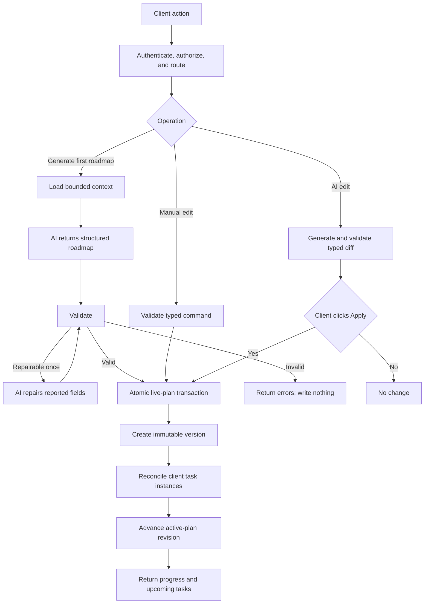

# 025 — Client-Owned Live AI Onboarding Roadmap

Status: Implemented
Depends on: 023 — Governed Onboarding Task Progress Roadmap
Scope: AI generation, immediate client editing, PostgreSQL persistence, task reconciliation, and
implementation roadmap

## 1. Decision summary

The onboarding roadmap is a client-owned, live process with only active, completed, and cancelled
lifecycle states. There is no Activate roadmap button.

- Generate with AI creates the first active roadmap immediately after validation.
- Create manually creates an active empty roadmap that the client can edit immediately.
- Every valid client create, update, move, or delete command becomes live in the same transaction.
- AI changes to an existing roadmap become live when the client clicks Apply.
- Every change is persisted to PostgreSQL as a new immutable roadmap version.
- The active plan points to the latest version and progress is recalculated from reconciled task
  instances.
- User edits never modify a shared template or another client's plan.
- Cancellation remains an explicit destructive action because it ends the process rather than
  editing its content.

The user's edit is the authorization. A second save, publish, or approval-receipt step would add
ceremony without adding a distinct product decision.

## 2. Product workflow

### 2.1 First roadmap

When no plan exists, the empty state provides two actions.

Generate with AI:

1. Client confirms the role, goal, timing, and relevant constraints.
2. The agent loads bounded authorized context.
3. The agent produces a structured roadmap.
4. Deterministic validation runs; one repair attempt is allowed.
5. A journey version, active plan, and task instances are written atomically.
6. The live roadmap, progress, and upcoming tasks appear.

Create manually:

1. Client selects Create manually.
2. The server creates an active roadmap with a title and no stages/tasks.
3. Each subsequent edit becomes live immediately.
4. A zero-task roadmap reports 0% progress and no upcoming tasks; it never reports 100%.

The Generate or Create action is the client's explicit instruction to create the live process.

### 2.2 Direct editing

The client can:

- change the roadmap title and dates;
- create, update, move, or delete a stage;
- create, update, move, or delete a task;
- change completion criteria, dependencies, timing, and whether a task counts toward progress.

Each interaction sends a typed command with the expected plan revision and an idempotency key. The
server validates and commits it atomically. The response returns the new roadmap version,
reconciled tasks, progress, and upcoming tasks.

Text fields may be debounced briefly in the browser, but there is no unpublished server-side copy.
The UI shows Updating, Updated, or Conflict rather than Save and Activate.

### 2.3 AI-assisted editing

AI never receives write authority.

1. Client asks for a change, optionally scoped to one stage or task.
2. Agent returns typed operations with rationale and warnings.
3. Server validates the operations and displays a concise diff.
4. Apply executes those operations and makes the result live immediately.
5. Dismiss leaves the roadmap unchanged.

Apply is the client edit that changes the live roadmap.

For low-risk AI additions, the UI may combine Review and Apply into one confirmation surface.
Changes that remove completed work, reset progress, or change dates must make that impact visible.

### 2.4 Editing an existing active process

Every successful edit creates an immutable journey-definition version and increments the active
plan revision. The plan remains active throughout the transaction.

- Unchanged tasks keep their instances and progress.
- New tasks begin as not_started.
- Moved tasks keep progress.
- Removed tasks are retired from the current projection but retained in history.
- A task whose completion meaning materially changes is reset to not_started unless a deterministic
  policy proves the previous completion is still valid.
- Completed-task removal or reset requires a targeted destructive confirmation, not whole-plan
  whole-plan restart.

Stable keys identify task lineage. They do not make records globally shared.

### 2.5 Cancellation

Cancel process is different from editing:

- it stops the roadmap from driving progress and upcoming tasks;
- it requires an explicit confirmation and reason;
- it records a cancellation event;
- it preserves all versions, task instances, and task events.

There is no hard delete for an active or historical process.

## 3. Storage and sharing model

### 3.1 PostgreSQL persistence

The customized process is stored in PostgreSQL after every successful change.

Use the existing core records:

- onboarding_journey_versions for immutable roadmap content snapshots;
- onboarding_plans for the client-owned live process and current definition pointer;
- onboarding_task_instances for client-specific task state;
- onboarding_task_events for progress history.

Add:

- onboarding_plan_revision_events for content-change history and version lineage;
- onboarding_ai_proposals for optional short-lived AI diff persistence;
- retired_at and retirement metadata on task instances, or an equivalent preserved-history model;
- supersedes_version_id on journey versions, or an equivalent lineage relation.

Do not add a staging table or a write-approval receipt table for ordinary editing.

### 3.2 Transaction boundary

One roadmap mutation transaction:

1. locks or compare-and-swaps the current plan revision;
2. loads the current immutable journey version;
3. applies and validates the typed command;
4. creates the next journey version;
5. reconciles task instances by stable key;
6. updates the plan's definition pointer and revision;
7. records the revision event;
8. commits;
9. builds the active projection.

If any step fails, none of the new version, task reconciliation, or plan pointer is committed.

### 3.3 Template sharing

Client task instances and client-customized roadmaps are never shared.

A reusable organization template may be shared only through a separate tenant-scoped,
versioned, published template catalog with an access policy. Applying a template copies or pins
its content into a new client-owned journey version and creates client-specific task instances.

After that:

- changing the client roadmap does not change the template;
- changing the template does not silently change existing client roadmaps;
- one client's progress never affects another client;
- a template update can be offered as an AI or deterministic change proposal.

Global public templates are out of scope until tenant isolation, publication review, and access
policy are implemented.

## 4. Agent-system assessment

| Cognitive function | Weight | Design implication                                                             |
| ------------------ | ------ | ------------------------------------------------------------------------------ |
| Perception         | Heavy  | Load client scope, current roadmap, goals, constraints, and authorized sources |
| Memory             | Heavy  | Separate request context, immutable versions, task state, and audit history    |
| Reasoning          | Heavy  | Generate coherent stages/tasks, dependencies, criteria, and dates              |
| Action             | Heavy  | Accepted output changes a live operational process                             |
| Reflection         | Heavy  | Deterministic validation plus one repair pass                                  |
| Collaboration      | Light  | One client and one agent; no specialist-agent coordination required            |
| Governance         | Heavy  | Tenant isolation, live-write safety, concurrency, provenance, and audit        |

This remains a single-agent system. The application, not the model, owns all writes.

## 5. Topology

### 5.1 Primary topology: Route

The application classifies intent before execution because reads, AI generation, direct writes,
AI proposals, task transitions, and cancellation have different controls.

| Intent                 | Route              | AI       | Result                                    |
| ---------------------- | ------------------ | -------- | ----------------------------------------- |
| Generate first roadmap | generate_live_plan | Yes      | Creates an active plan atomically         |
| Create manually        | create_live_plan   | No       | Creates an empty active plan              |
| Direct roadmap edit    | mutate_live_plan   | No       | Immediately creates the next live version |
| Ask AI to edit         | propose_change     | Yes      | Returns a validated diff                  |
| Apply AI edit          | apply_change       | No       | Immediately creates the next live version |
| View/explain           | read_projection    | Optional | No state change                           |
| Update task progress   | transition_task    | No       | Uses spec 023 state transitions           |
| Cancel process         | cancel_plan        | No       | Explicit destructive lifecycle transition |

### 5.2 Bounded generation loop

Only generation and AI proposal creation can loop:

1. generate structured output;
2. validate schema, references, dependencies, limits, and policy;
3. if errors are repairable, provide the error report for one repair;
4. validate again;
5. return valid operations or fail without writing.

Limits:

- at most two model calls;
- no database write before validation succeeds;
- no additional tools during repair;
- no relaxation of policy;
- no unbounded self-critique.

### 5.3 Rejected complexity

- No staging/publish state machine.
- No approval receipt for ordinary roadmap edits.
- No multi-agent debate, hierarchy, or parallel writers.
- No free-form AI write tool.
- No in-place mutation that destroys the prior roadmap version.
- No automatic propagation from shared templates.

## 6. Selected patterns

| Pattern              | Placement                     | Purpose                                                           |
| -------------------- | ----------------------------- | ----------------------------------------------------------------- |
| Context triage       | Before AI work                | Load only authorized, decision-relevant context                   |
| Layered retention    | Request, version, task, audit | Preserve history without mixing user scopes                       |
| Structured reasoning | Model output                  | Produce typed roadmap content or edit operations                  |
| Guardrail sandwich   | Before and after AI           | Constrain context and validate all output                         |
| Self-healing loop    | AI branch only                | Repair structured output once                                     |
| Human confirmation   | Targeted destructive changes  | Expose completed-work removal/reset and cancellation              |
| Observability        | Every route                   | Diagnose model, validation, concurrency, and transaction behavior |

### 6.1 Context triage

Load:

1. authenticated owner, tenant, session, and role;
2. current roadmap summary and relevant selected content;
3. client goals, dates, preferences, and constraints;
4. authorized published knowledge-map version;
5. bounded cited RAG chunks;
6. organization roadmap policy.

Do not expose another client's process, unrestricted source text, secrets, or database access.

### 6.2 Guardrail sandwich

Before AI:

- authenticate and resolve tenant/owner server-side;
- route the request;
- apply stage/task/date and retrieval limits;
- retrieve only published authorized sources;
- treat source content as untrusted data.

After AI:

- parse a strict schema and reject unknown fields;
- validate stable-key uniqueness, dependencies, dates, ordering, and limits;
- verify source references belong to the authorized retrieval result;
- calculate task-progress impact;
- optionally repair once;
- pass valid typed operations to deterministic application services.

## 7. Execution flow



## 8. Interfaces

### 8.1 Live roadmap command

```ts
type RoadmapCommand =
  | { type: 'set_metadata'; title?: string; startAt?: string; targetAt?: string | null }
  | { type: 'add_stage'; stage: NewStage; afterStageId?: string }
  | { type: 'update_stage'; stageId: string; patch: StagePatch }
  | { type: 'move_stage'; stageId: string; afterStageId?: string }
  | { type: 'delete_stage'; stageId: string }
  | { type: 'add_task'; stageId: string; task: NewTask; afterTaskId?: string }
  | { type: 'update_task'; taskId: string; patch: TaskPatch }
  | { type: 'move_task'; taskId: string; toStageId: string; afterTaskId?: string }
  | { type: 'delete_task'; taskId: string };

interface RoadmapCommandRequest {
  expectedPlanRevision: number;
  idempotencyKey: string;
  command: RoadmapCommand;
  destructiveConfirmation?: {
    impactHash: string;
  };
}
```

The server derives owner, tenant, plan, actor, timestamps, version IDs, and audit metadata.

### 8.2 AI change proposal

```ts
interface RoadmapChangeProposal {
  id: string;
  planId: string;
  basePlanRevision: number;
  baseContentHash: string;
  operations: RoadmapCommand[];
  rationale: string;
  assumptions: string[];
  warnings: string[];
  progressImpact: {
    completedTasksRetained: number;
    completedTasksReset: number;
    tasksAdded: number;
    tasksRetired: number;
  };
  sourceReferences: string[];
  expiresAt: string;
}
```

Apply requires the current plan revision and exact proposal hash. A stale proposal is rejected
rather than silently rebased.

### 8.3 Task reconciliation

| Change                                      | Reconciliation                                                      |
| ------------------------------------------- | ------------------------------------------------------------------- |
| Stable key and completion meaning unchanged | Retain instance, status, and event history                          |
| Task moved to another stage                 | Retain status; update current stage reference                       |
| New stable key                              | Create a not_started instance                                       |
| Task removed                                | Set retired metadata; exclude from live progress and upcoming tasks |
| Completion criteria materially changed      | Reset to not_started and record reset reason                        |
| Due policy changed                          | Recalculate due date and record old/new values                      |
| Dependency changed                          | Recompute blocked/available projection deterministically            |

Task events remain append-only. The current task projection is derived from the latest roadmap
version plus non-retired instances and events.

### 8.4 API surface

```text
GET   /api/sessions/:sessionId/onboarding
POST  /api/sessions/:sessionId/onboarding/generate
POST  /api/sessions/:sessionId/onboarding/manual
POST  /api/sessions/:sessionId/onboarding/commands

POST  /api/sessions/:sessionId/onboarding/ai-proposals
POST  /api/sessions/:sessionId/onboarding/ai-proposals/:proposalId/apply

PATCH /api/sessions/:sessionId/onboarding/tasks/:taskId
POST  /api/sessions/:sessionId/onboarding/cancellation-impact
POST  /api/sessions/:sessionId/onboarding/cancel
```

All mutating endpoints require authentication, tenant/owner authorization, CSRF protection where
applicable, idempotency, expected revision, limits, and consistent error DTOs.

### 8.5 Agent tool boundary

Read-only, scope-aware tools:

- load_client_onboarding_context;
- load_active_plan_summary;
- load_selected_roadmap_content;
- search_authorized_knowledge;
- load_authorized_knowledge_map;
- resolve_authorized_source_reference.

No generic fetch, SQL, shell, filesystem, repository write, cancellation, plan-creation, or
task-transition tool is available to the agent.

## 9. Client experience

### 9.1 Empty state

Replace No active plan with:

- Generate with AI;
- Create manually;
- a short explanation that the roadmap becomes live immediately and remains editable.

Generation shows context, generation, validation, and completion states. Failure offers retry and
manual creation. It does not create a partial plan.

### 9.2 Live editor

The live roadmap page includes:

- inline title and date editing;
- stage/task add, update, reorder, and delete;
- completion criteria, dependencies, weight, and timing;
- Ask AI for the roadmap or selected content;
- AI diff with Apply or Dismiss;
- Updating, Updated, Conflict, and Failed indicators;
- version timestamp and change history;
- progress and upcoming tasks refreshed from the server projection.

There is no Save for later or Activate roadmap action.

### 9.3 Conflicts

When expectedPlanRevision is stale:

- do not overwrite the latest process;
- return the latest revision and conflicting fields;
- preserve unsent local text in the browser;
- allow the client to retry the edit against the current version.

Do not use last-write-wins for structured roadmap changes.

## 10. Governance and safety

### 10.1 Authority matrix

| Operation              | Client                  | AI                  | Application                  |
| ---------------------- | ----------------------- | ------------------- | ---------------------------- |
| Generate first roadmap | Initiates live creation | Produces candidate  | Validates and transacts      |
| Direct roadmap edit    | Issues command          | Not involved        | Validates and transacts      |
| AI-assisted edit       | Requests and applies    | Proposes typed diff | Validates and transacts      |
| Task transition        | Issues action           | No authority        | Enforces state machine       |
| Cancel process         | Confirms with reason    | No authority        | Records lifecycle transition |
| Cross-tenant access    | No                      | No                  | Denies                       |

### 10.2 Blast-radius limits

- at most 12 stages;
- at most 20 tasks per stage;
- at most 120 active tasks total;
- at most two model calls per AI request;
- at most 12 retrieved chunks across 6 sources;
- model, retrieval, and transaction timeouts;
- AI proposal expiry after 24 hours;
- one active plan per client/session scope;
- one atomic content command per expected revision.

### 10.3 Privacy and prompt injection

- Owner and tenant come from the authenticated session, never model output.
- Retrieval is tenant-, publication-, and version-filtered.
- Retrieved instructions are treated as untrusted reference content.
- Prompts and traces exclude secrets and unnecessary personal data.
- Source references are checked against the actual authorized retrieval set.
- Audit logs store structured metadata and hashes instead of sensitive prompt text where possible.

### 10.4 Observability

Emit structured events:

- roadmap.route.selected;
- roadmap.generation.started/completed/failed;
- roadmap.validation.failed;
- roadmap.repair.attempted;
- roadmap.version.created;
- roadmap.command.applied/failed;
- roadmap.ai_proposal.created/applied/dismissed/stale;
- roadmap.task.reconciled/retired/reset;
- roadmap.revision.conflict;
- roadmap.cancellation.completed/failed;
- roadmap.authorization.denied.

Metrics:

- generation latency, token use, first-pass validation, and repair success;
- command success, transaction latency, and revision conflict rate;
- AI proposal acceptance and stale-proposal rate;
- task retention/reset/retirement counts;
- projection consistency;
- cross-tenant denial and citation-validation failures.

## 11. Failure and recovery

| Failure                            | Behavior                                                             |
| ---------------------------------- | -------------------------------------------------------------------- |
| Retrieval unavailable              | Offer manual creation or user-context-only generation with a warning |
| Model timeout/error                | Follow bounded retry policy; do not create or change the plan        |
| Invalid AI output                  | Repair once, then return actionable errors with no write             |
| Invalid manual command             | Return field errors; current live version remains unchanged          |
| Revision conflict                  | Return latest version; do not overwrite                              |
| Stale AI proposal                  | Reject and ask the client to regenerate                              |
| Transaction failure                | Roll back version, plan pointer, and task reconciliation             |
| Ambiguous completion carry-forward | Require targeted confirmation or reset conservatively                |
| Agent unavailable                  | Manual editing and task progress continue to work                    |

## 12. Evaluation

### 12.1 Golden scenarios

- Generate a valid first roadmap and immediately show active progress/tasks.
- Create an empty manual roadmap and add stages/tasks directly to the live process.
- Edit a title, move a task, and add a dependency with one new version per command.
- Apply an AI proposal and immediately return the updated projection.
- Preserve completed progress when an unchanged task moves stages.
- Retire a removed task without deleting its history.
- Reset a completed task when its completion meaning materially changes.
- Continue manual editing when AI is disabled.

### 12.2 Adversarial scenarios

- Retrieved text instructs the model to write to the database or expose another tenant.
- AI returns duplicate keys, dependency cycles, unknown fields, or more than 120 tasks.
- Client tampers with an AI proposal or applies it to a newer revision.
- Two tabs update the same plan revision.
- Client removes a completed task without the required targeted confirmation.
- Template update attempts to mutate existing client plans.
- Client targets another owner's plan or task.
- Transaction fails after a new journey version is inserted but before reconciliation.

### 12.3 Acceptance criteria

- Every successful roadmap command is visible immediately in the active projection.
- Every successful change is persisted in PostgreSQL as a new immutable version.
- No separate staging or start step exists.
- No AI path can write directly, transition tasks, or cancel a process.
- All writes use deterministic services, owner/tenant authorization, idempotency, and revision
  checks.
- Client progress is preserved only under explicit deterministic reconciliation rules.
- Removed tasks and old roadmap versions remain auditable.
- Templates and customized processes cannot mutate each other.
- Manual creation/editing works with the AI provider disabled.
- Existing spec 023 progress and task-transition invariants remain green.

## 13. Rollback and fallback

- Feature flags independently control AI generation, AI proposals, and live editing.
- Disabling AI leaves manual creation, editing, progress, and cancellation available.
- New revision/history fields and tables are additive.
- Existing active plans remain readable.
- A failed edit leaves the prior version active.
- A failed generation creates no partial plan.
- Rollback of a bad product release disables new mutations without deleting stored versions.
- Restoring an earlier roadmap is implemented as a new forward version, never a history rewrite.

## 14. Minimal build

Start with:

- one agent;
- Route topology;
- read-only retrieval tools;
- one validation repair;
- immediate typed client commands;
- optional AI diff and Apply;
- immutable PostgreSQL versions;
- deterministic task reconciliation;
- existing progress projection.

Do not add staging workflows, parallel agents, semantic process memory, or background
orchestration until measured needs justify them.

## 15. Implementation to-do

### 15.1 Contracts and database

- [x] Add shared schemas for live roadmap commands, AI proposals, reconciliation results, and
      destructive-impact confirmations.
- [x] Add journey-version lineage and plan revision-event persistence.
- [x] Add retired task-instance metadata without breaking existing task-event history.
- [x] Add AI proposal storage only if proposals must survive page refresh.
- [x] Define canonical content and impact hashing.
- [x] Do not add staging or write-approval receipt tables.

### 15.2 Domain services

- [x] Implement RoadmapCommandService with expected revision and idempotency.
- [x] Implement validators for stable keys, dates, limits, dependencies, weights, and references.
- [x] Implement immutable version creation and active-plan pointer advancement.
- [x] Implement deterministic task reconciliation and progress recomputation.
- [x] Implement targeted impact checks for completed-task removal/reset.
- [x] Implement append-only revision events and cancellation.

### 15.3 Agent workflow

- [x] Add routes for first-roadmap generation and existing-roadmap AI edits.
- [x] Implement bounded, tenant-scoped context assembly.
- [x] Define strict structured-output schemas for roadmaps and typed operations.
- [x] Implement deterministic validation and one repair pass.
- [x] Expose only the read-only tools listed in this spec.
- [x] Add prompt-injection controls, citation checks, timeouts, and model-call limits.

### 15.4 API

- [x] Add Generate and Create manually endpoints that create active plans.
- [x] Add one live RoadmapCommand endpoint.
- [x] Add AI proposal and Apply endpoints.
- [x] Keep task transitions separate from content editing.
- [x] Add targeted destructive-impact and cancellation endpoints.
- [x] Apply auth, tenant scope, CSRF, rate limits, revisions, idempotency, and correlation IDs.
- [x] Replace the full-definition plus approved=true contract with immediate live creation.

### 15.5 Client

- [x] Replace dead-end empty states with Generate with AI and Create manually.
- [x] Build the live inline roadmap editor.
- [x] Send typed commands and show Updating, Updated, Conflict, and Failed states.
- [x] Add Ask AI with concise diff and Apply/Dismiss.
- [x] Add targeted confirmations for completed-work resets/removals.
- [x] Remove Save for later and Activate roadmap concepts.
- [x] Refresh progress and upcoming tasks from every successful server projection.
- [x] Add version/change history and cancel-process controls.

### 15.6 Tests and rollout

- [x] Unit-test schemas, commands, validators, hashing, reconciliation, and projections.
- [x] Integration-test atomic version/pointer/task transactions and injected rollbacks.
- [x] Test idempotency, stale revisions, stale proposals, and two-tab conflicts.
- [x] Test cross-tenant denial and template/client isolation.
- [x] Evaluate grounded generation and adversarial prompt injection.
- [ ] End-to-end test Generate, Create manually, immediate CRUD, AI Apply, progress preservation,
      task retirement/reset, cancellation, and AI-disabled fallback.
- [ ] Ship additive schema first, then manual live editing, AI generation, and AI proposals.
- [ ] Monitor transaction latency, conflicts, reconciliation outcomes, and support issues.

## 16. Architecture review

- All seven cognitive functions are assessed.
- Route is the simplest topology matching the authority boundaries.
- The only loop is bounded to one repair and cannot write.
- The client edit itself authorizes the live change; redundant ceremony is removed.
- Every change creates an immutable PostgreSQL version.
- Task progress is client-specific and reconciled deterministically.
- Shared templates are versioned inputs, never shared live task state.
- AI tools are read-only and tenant-scoped.
- Failure leaves the previous active version intact.
- Manual operation remains available when AI fails.
- Observability covers routing, model work, validation, versioning, reconciliation, and conflicts.
- The design starts with one agent and scales only on measured evidence.
