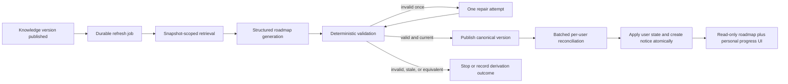

# 026 — Ingestion-Driven Static Onboarding Roadmap

Status: Implemented
Depends on: 023 — Governed Onboarding Task Progress Roadmap; 024 — Scheduled Extensible RAG
Ingestion
Supersedes: the client-ownership, user-generation, editing, proposal, cancellation, and session-scoping
decisions in 025 — Client-Owned Live AI Onboarding Roadmap
Scope: one system-owned roadmap, post-ingestion generation, per-user progress reconciliation,
durable in-app update notices, migration, and obsolete UI/API removal

## 1. Decision summary

The product has one static onboarding roadmap generated by the system from the latest successfully
published knowledge-base version. Users do not create, regenerate, edit, reorder, delete, or cancel
the roadmap.

The roadmap definition and a learner's state are different records:

- The canonical roadmap is global, immutable by version, and owned by the system.
- A user roadmap state points to the canonical version that has been applied for that user.
- Task status, completion metadata, due dates, and state revisions belong only to the user state.
- Users may continue to update their own task progress. This is not authority to change the shared
  roadmap definition.

After a new knowledge source version is published, a durable background job generates and validates
a new canonical roadmap. If its content changed, the system publishes it, reconciles every eligible
user to it, and creates one durable in-app update notice for each successfully reconciled user.

Old roadmap versions, retired user items, task events, and legacy client-owned plans remain stored.
"Store both existing items" means preserving canonical version history and user item/history rows;
removed items do not remain in the live roadmap projection.

## 2. Product invariants

1. **System ownership:** no authenticated user action can mutate canonical roadmap content or
   lifecycle.
2. **Published knowledge only:** roadmap generation never reads a staged, review-pending, failed,
   cancelled, or partially ingested source version.
3. **Separate versions:** `versionId`/`versionNumber` identify system content; `stateRevision` and
   task revisions identify user progress. One counter must never represent both.
4. **Applied-version reads:** a user sees the roadmap version referenced by their user state, not a
   newer global version whose reconciliation has not reached them yet.
5. **No lost progress:** rollout and learner task transitions are serialized or compare-and-swapped
   so neither can overwrite the other.
6. **No destructive replacement:** prior canonical versions, retired item state, and append-only
   events remain queryable for audit and rollback.
7. **Truthful notification:** a roadmap update notice is visible only after that user's state has
   been successfully reconciled to the referenced version.
8. **No duplicate work:** unchanged ingestion, content equivalent to the current roadmap, retries,
   and duplicate deliveries do not create duplicate content versions, rollouts, or notices. An
   intentional rollback to historical content is a new publication occurrence, not a duplicate.
9. **Public evidence only:** a global roadmap may use only sources explicitly authorized for
   `all_users`. Narrower audience content is rejected, not summarized into a global artifact.
10. **Chat independence:** changing or deleting a chat session never changes roadmap content,
    progress, rollout, or notice state.
11. **Policy-gated automation:** this roadmap is an explicitly approved exception to spec 024's
    default human-review guidance for high-impact derived memory. Automatic publication is allowed
    only while every scope, snapshot, validation, fencing, rollout, observability, and kill-switch
    gate in this spec is enabled.

## 3. Deliberate scope

### 3.1 In scope

- One canonical roadmap with immutable versions.
- Automatic refresh from the current aggregate SharePoint knowledge source.
- Structured AI generation with deterministic validation and one bounded repair attempt.
- Idempotent user-state reconciliation by stable item key and completion semantics.
- A roadmap-specific durable in-app notice.
- Removal of all client roadmap-definition controls and their frontend plumbing.
- Retirement of public definition-mutation endpoints.
- Non-destructive migration of current plans, tasks, events, and proposals.

### 3.2 Out of scope

- User-specific, role-specific, tenant-specific, or chat-specific roadmap definitions.
- User prompts, manual roadmap creation, AI change proposals, drafts, approvals, or cancellation.
- Email, SMS, operating-system push, web push, a notification bell, or a generic notification center.
- Live collaborative editing or user-visible canonical version history.
- Generating inside an ingestion database transaction or cron request.
- A general multi-source knowledge refresh batch. The current production source is one aggregate
  folder; adding independent authoritative sources requires the extension in section 7.5 first.
- Deleting legacy roadmap data in the first release.

## 4. Right-sized execution design

This workflow is a single governed chain, not a multi-agent system. Parallelism is useful only for
bounded user fan-out after a roadmap version has been published.

| Cognitive function | Weight | Required behavior                                                                              |
| ------------------ | ------ | ---------------------------------------------------------------------------------------------- |
| Perception         | Heavy  | Read an explicit immutable knowledge snapshot, with provenance and scope checks.               |
| Memory             | Heavy  | Persist jobs, canonical versions, rollout state, user progress, events, and notices.           |
| Reasoning          | Heavy  | Convert source material into a coherent typed roadmap while preserving item lineage.           |
| Action             | Heavy  | Publish one version, reconcile the captured user cohort, and emit durable notices.             |
| Reflection         | Heavy  | Validate structure, sources, stable keys, and semantic continuity before publication.          |
| Collaboration      | None   | There is no user/agent or agent/agent negotiation.                                             |
| Governance         | Heavy  | A generated artifact affects all users, so scope, ordering, audit, and rollback are mandatory. |

Selected patterns are retrieval augmentation, structured output, a guardrail sandwich, one bounded
self-repair attempt, layered retention, and blast-radius controls. The execution topology is:



The workflow stops safely on invalid output, unauthorized evidence, a stale snapshot, or exhausted
retry budget. It keeps the previously published roadmap and all existing user states live.

## 5. End-to-end workflow

### 5.1 Knowledge ingestion completes

For the current production topology, the authoritative source is
`tax-consulting-sharepoint`, an enabled aggregate SharePoint folder with `all_users` access.
The configured roadmap-authoritative source ID is singular and fail-closed: publication of any
other source does not enqueue a roadmap job. Startup/registry validation refuses zero or multiple
roadmap-authoritative sources until section 7.5 is implemented.

Completion has precise meanings:

| Ingestion result                           | Roadmap behavior                                                             |
| ------------------------------------------ | ---------------------------------------------------------------------------- |
| `version_published` / run `succeeded`      | Enqueue reconciliation for the newly published source version.               |
| `source_unchanged` / run `unchanged`       | Record a successful no-op; do not generate, roll out, or notify.             |
| `requires_review`                          | Wait. It is not a new current knowledge version.                             |
| Review approval                            | Approval publishes the source version and therefore enqueues reconciliation. |
| Review rejection, `failed`, or `cancelled` | Do nothing; retain the current roadmap and user states.                      |
| Source rollback                            | Reconcile after the restored source version becomes current.                 |

The enqueue write belongs in the same short transaction that changes
`KnowledgeSource.currentVersionId` and writes `version_published`. The transaction writes only a
durable refresh job/outbox record. It must not call retrieval, a model, user fan-out, or notification
delivery.

This is the crash-safe publication boundary used by automatic publication, later review approval,
and rollback. Hooking the cron route, worker return, or `completedAt` would miss paths or run before
the new knowledge version is actually retrievable.
Every publication transaction creates a unique publication occurrence ID for the roadmap outbox,
even when no ingestion-run event was supplied by the caller.

An authoritative source disablement or change away from `all_users` is also a governance event,
even if it does not publish a version. It atomically suspends the canonical roadmap, disables new-
user application, and enqueues an operator-visible re-derivation decision. Existing users retain
their last applied state for audit but the UI must not present its evidence as current. Re-enabling
requires a fresh authorized publication/reconciliation. Scope and enabled status are rechecked both
before model use and under the roadmap-publication lock.

### 5.2 Capture the generation input

The refresh job stores an immutable input descriptor:

```ts
type StaticRoadmapInput = {
  publicationEventId: string;
  refreshSequence: number;
  sourceId: 'tax-consulting-sharepoint';
  sourceVersionId: string;
  sourceManifestHash: string;
  accessScope: 'all_users';
  embeddingProfileId: string;
  retrievalConfigVersion: string;
  retrievalQuerySetVersion: string;
  objectiveVersion: string;
  generatorSchemaVersion: string;
  promptVersion: string;
  provider: string;
  model: string;
  decodingConfigVersion: string;
  lineageBaseCanonicalVersionId: string | null;
  lineageBaseContentHash: string | null;
};
```

`knowledgeSnapshotHash` hashes the source ID, source version ID, manifest/content hash, access
scope, and embedding/retrieval profile. `artifactKey` additionally hashes the fixed objective,
retrieval query set, generator schema, prompt, provider/model/decoding configuration, and captured
lineage-base version/content hash. Store both on the job and canonical version. The publication
event/occurrence, not `artifactKey`, is the refresh enqueue idempotency identity; this allows an
intentional A -> B -> A source rollback to run a new rollout while reusing a safely cached artifact.

The generator uses a snapshot-scoped retriever that filters by the captured source version ID. It
must not use the generic live RAG path, because that path may observe a later current version at
execution time. It also excludes seed knowledge, request-time adapters, and web search. If one of
those inputs becomes intentional later, it must be versioned, authorized for all users, captured in
the input descriptor, and included in the hash.

The job must have immutable evidence for its lifetime. Before enabling this workflow, either make
source-version documents and the selected embedding index append-only, with a new physical index
identity for every extractor/chunker/embedding change, or materialize the exact bounded evidence
bundle selected for the job. Store a hash over canonically ordered document/chunk identities and
text, and use deterministic similarity tie-breaking. Nonterminal jobs and retained canonical
versions pin their cited source-version/evidence records with foreign-key-backed references so
ingestion retention cannot delete them. Release failed/stale job pins only after the job retention
window; published canonical evidence remains pinned for that version's retention lifetime.

### 5.3 Generate and validate

The worker uses a fixed, versioned product objective rather than a user's goal, role, title, or
dates. Retrieval uses a deterministic, versioned query set and bounded result limits over the
captured source version. The prompt treats source text as untrusted data and permits no tools or
side effects.

The generated contract contains:

- roadmap title and optional summary;
- 1–12 ordered stages;
- 1–20 ordered tasks per stage and no more than 120 tasks total;
- stable stage and task keys;
- task description, measurable completion criteria, required/progress flags, due offset, weight,
  and dependency keys;
- source references tied to the captured source/version/section;
- assumptions and non-blocking warnings.

Deterministic validation rejects:

- unknown, duplicate, or recycled stable keys;
- duplicate positions, invalid dependencies, or dependency cycles;
- invalid counts, weights, dates, or progress semantics;
- source references outside the captured authorized set;
- use of a prior key for materially different completion semantics;
- missing evidence for a required roadmap item;
- output that cannot be serialized to the versioned schema.

The captured `lineageBaseCanonicalVersionId` is loaded by ID and supplied as lineage context; the
worker never resolves "current canonical" dynamically during generation. The generator must reuse
an existing key only when the item's completion meaning is unchanged. A materially different item
gets a new key; a removed key is never recycled. One invalid initial output may receive one model
repair call. A second invalid output fails the job and alerts operations; there is no unbounded
agent loop. If the lineage base changed before publication, the job is stale and a new job captures
the newer base rather than rebasing silently.

### 5.4 Publish the canonical version

Before publication, the worker locks the singleton roadmap root and verifies that:

- the job still represents the current authoritative source version;
- the source remains enabled and `all_users`;
- no newer refresh sequence has won;
- the worker owns the current job claim/fencing token; and
- whether the generated content hash differs from the current canonical content hash.

If the input is stale, mark the job `stale`; never overwrite a roadmap created from newer
knowledge. If user-visible content and item semantics are identical to the **currently applied
canonical content**, publish an immutable derivation-equivalence record for the new knowledge
snapshot and advance the root's provenance pointer without changing its current content version.
Do not create a user rollout or notification. This proves the current content was revalidated
against the new knowledge without rewriting the old version. Evidence/source-reference changes are
part of derivation provenance but do not by themselves force a user rollout. Equality with a
historical, non-current version does not suppress an intentional rollback: publish a new canonical
content version/sequence, optionally reusing the cached artifact, then roll it out and notify.

Otherwise one transaction:

1. inserts an immutable canonical journey version;
2. supersedes the prior canonical version;
3. advances the singleton roadmap pointer and canonical revision;
4. creates a rollout and captures its eligible user cohort; and
5. writes the publication audit event and marks the refresh job terminal using the same claim token.

Generation failure never rolls back source publication. The static roadmap is a governed derived
artifact, not part of ingestion success.

### 5.5 Reconcile every eligible user

"All users" in this milestone means every extant account with `User.isActive = true` when the
rollout cohort is captured. The cohort is based on users, not onboarding/chat sessions. An active
legacy plan whose owner does not resolve to an active User is an integrity exception, not a rollout
recipient. A newly activated or newly created user is initialized directly against the latest
canonical version. Inactive accounts do not receive a notice.

The rollout worker processes the captured cohort in bounded batches. A user may see their notice as
soon as their own atomic sync succeeds; it does not wait for every other user. One transaction per
user:

1. locks or compare-and-swaps the user's roadmap state;
2. reloads the latest task revisions;
3. reconciles canonical tasks using the rules in section 6.3;
4. changes `appliedVersionId` to the new canonical version;
5. increments only the user's `stateRevision`;
6. appends system-authored reconciliation/task events; and
7. inserts the user's update notice with a unique user/version key.

The notice is committed with the user state, so it cannot announce a version that the user cannot
read. A failed user transaction leaves that user on the prior applied version and creates no notice.
Retries target only missing or failed user-sync rows.

The rollout is `complete` only when every captured user sync succeeds. A partial failure is visible
to operations and remains retryable; it does not corrupt successfully updated users. At most one
rollout publishes user updates for the singleton roadmap at a time. New refreshes queue behind a
published rollout, while unstarted generation jobs may coalesce to the newest knowledge snapshot.
Persistent failures have an operations SLA and do not block generation forever: after the bounded
retry threshold, a newer rollout may supersede the failed rollout for unresolved users. Each user
state's `desiredVersionId` advances monotonically to the newest target; an older sync must CAS that
target and can never overwrite a user already applied to a newer version. Intermediate notices are
created only for versions actually applied to that user.

## 6. State and persistence model

### 6.1 Canonical roadmap state

Add one `onboarding_roadmaps` root row for `key = 'default'`:

| Field                          | Purpose                                                         |
| ------------------------------ | --------------------------------------------------------------- |
| `id`, `key`                    | Stable global identity; `key` is unique.                        |
| `currentVersionId`             | Latest user-visible canonical content version.                  |
| `currentDerivationId`          | Latest accepted derivation/evidence result for that content.    |
| `revision`                     | Monotonic system content revision only.                         |
| `currentKnowledgeSnapshotHash` | Knowledge snapshot most recently validated against the content. |
| `createdAt`, `updatedAt`       | Audit timestamps.                                               |

Reuse `onboarding_journey_versions` additively for content-immutable canonical versions by adding nullable
`roadmapId`, `versionNumber`, `contentHash`, `knowledgeSnapshotHash`, input descriptor/provenance,
generator/schema/prompt versions, `publishedAt`, and generation job linkage. Make `ownerId`
nullable for canonical rows; retain it on legacy owner-specific rows.

Canonical version lifecycle metadata may move `candidate -> published -> superseded`; content and
provenance never mutate, and append-only publication events plus the root pointer are authoritative.
Failed generation remains on the job rather than becoming a canonical version. Add conditional
constraints: a canonical row has null `ownerId` and non-null roadmap/version/content fields, while a
legacy row retains its existing required shape and relations. Enforce uniqueness on
`(roadmapId, versionNumber)`; `artifactKey` indexes reusable generated artifacts rather than
suppressing publication occurrences. Canonical stages/tasks contain no
learner status, completion timestamp, or absolute due date.

Add immutable derivation-equivalence records keyed by roadmap, knowledge snapshot, and current
content version. A no-content-change refresh advances only the roadmap root's derivation/provenance
pointer to this record; the content-version pointer stays fixed. These records pin their evidence
and make current-knowledge validation auditable without notification spam.

Define `contentHash` as a versioned canonical JSON serialization of user-visible roadmap structure
and semantic item fields. Normalize object keys, Unicode/text, numeric forms, and task/stage order;
exclude generated persistence IDs, timestamps, provider usage, warnings, audit metadata, and source
references. Define a separate versioned `evidenceHash` over canonically ordered source references
and the pinned evidence bundle. Publication allocates `versionNumber` while locking the root, and
its compare-and-swap requires the prior root revision plus refresh fencing sequence.

### 6.2 User roadmap state

`onboarding_plans` remains the first-release physical user-state store to minimize migration risk,
but its target responsibility is `UserRoadmapState`, not roadmap ownership. Add:

| Field                                     | Purpose                                                             |
| ----------------------------------------- | ------------------------------------------------------------------- |
| `roadmapId`                               | Canonical roadmap root.                                             |
| `appliedVersionId`                        | Canonical version safely reconciled for this user.                  |
| `desiredVersionId`                        | Optional rollout target while pending/retrying.                     |
| `stateRevision`                           | Per-user optimistic concurrency; independent of canonical revision. |
| `syncStatus`                              | `current`, `pending`, or `failed`.                                  |
| `firstAppliedAt`, `syncedAt`, `syncError` | User-state lifecycle and operations visibility.                     |

The canonical user-state row is permanent and has no completed/cancelled lifecycle; completion is a
projection of its task states. Enforce one canonical row per `(ownerId, roadmapId)` where
`roadmapId IS NOT NULL`; legacy nullable-roadmap rows keep their historical status. `sessionId`
becomes nullable legacy provenance and must not participate in lookup, creation, or ownership.
Existing cancelled or completed legacy plans remain historical records and are not revived.
`appliedVersionId` is the sole canonical content pointer and `stateRevision` the sole user-state
counter; legacy `definitionVersionId`, `status`, and `revision` become read-only provenance after
cutover rather than competing authorities.

Canonical user-state ownership must resolve to a `User` UUID/FK. Do not copy a development or
orphan text owner ID into that relation; quarantine and report it during integrity migration.

User task status remains in `onboarding_task_instances` with the existing statuses
`not_started`, `in_progress`, `blocked`, `completed`, and `waived`. Add or formalize:

- partial unique current identity `(planId, stableKey) WHERE retiredAt IS NULL` after a collision
  audit, plus immutable canonical item lineage identity;
- the canonical item/version link most recently applied;
- completion-semantics hash;
- introduced, last-applied, and retired canonical version IDs; and
- retirement timestamp/reason.

Absolute `dueAt`, status, status revision, `completedAt`, and `completedBy` are user state. The
canonical task stores only a due offset. Preserve the user's original `startAt` during migration;
new users use their first application time. Recalculate due dates deterministically from that
anchor when a canonical due offset changes.

### 6.3 Item reconciliation

| Canonical change                                   | User-state result                                                                                                     |
| -------------------------------------------------- | --------------------------------------------------------------------------------------------------------------------- |
| Same stable key and same completion-semantics hash | Preserve task ID, status, revisions, completion metadata, and history; update definition/stage/order/due projections. |
| New stable key                                     | Create `not_started` user item state.                                                                                 |
| Key removed                                        | Mark the user item retired; exclude it from live progress/upcoming projections but retain its row and events.         |
| Material completion meaning changes                | Require a new stable key; retire the old item and create the new item as `not_started`.                               |
| Stage/title/description/order changes only         | Preserve progress.                                                                                                    |

Define and persist `semanticsHashVersion`. Its canonical serialization includes normalized
completion criteria, required flag, counts-toward-progress flag, weight, dependency semantics, and
waiver policy; adding another progress-affecting field requires a new hash version. A same-key
semantic change rejects canonical publication rather than silently resetting user states.

Add a dedicated append-only reconciliation event table for `item_added`, `item_retained`,
`item_retired`, `item_due_date_changed`, and user-version application. Do not overload
`OnboardingTaskEvent`, whose required from/to statuses describe learner transitions. A retained item
does not increment task revision unless a task field guarded by the learner CAS changes; rollout
CASes user `stateRevision`, locks active item rows, and never bulk-upserts status/completion fields.
If a transition races a rollout, it either commits first and is carried forward, or the rollout/
transition reloads and retries; progress is never last-write-wins.

### 6.4 Durable workflow records

Add:

- `onboarding_roadmap_refresh_jobs`, unique by roadmap and publication event/occurrence, with
  indexed `artifactKey`, captured input,
  sequence, status, attempts, lease, error, and timestamps;
- `onboarding_roadmap_rollouts`, unique by canonical version, with cohort snapshot/counts, status,
  cursor, and timestamps;
- `onboarding_roadmap_user_syncs`, unique by user state and target version, with attempt/status/error
  and per-user reconciliation counts; and
- `onboarding_roadmap_update_notices`, unique by user and canonical version.
- `onboarding_roadmap_reconciliation_events`, append-only system events distinct from learner task
  status events.

These records are the outbox, retry ledger, and audit trail. Do not rely on an in-memory queue.

## 7. Trigger, ordering, and failure semantics

### 7.1 Idempotency keys

| Operation                | Idempotency identity                                          |
| ------------------------ | ------------------------------------------------------------- |
| Refresh enqueue          | `(roadmapId, publicationEventId)`; rollback is a new event    |
| Generated artifact cache | `(roadmapId, artifactKey, evidenceBundleHash)`                |
| Canonical version        | `(roadmapId, versionNumber)` with root-revision CAS           |
| Derivation equivalence   | `(roadmapId, knowledgeSnapshotHash, currentContentVersionId)` |
| Rollout                  | `canonicalVersionId`                                          |
| User sync                | `(userRoadmapStateId, targetVersionId)`                       |
| Notice                   | `(userId, canonicalVersionId)`                                |

Duplicate ingestion delivery returns the existing refresh job. A worker retry resumes durable
state. It does not repeat completed user syncs or notices.

### 7.2 Retry policy

- Network, timeout, 408, 429, and upstream 5xx failures use bounded exponential retry within the
  configured worker attempt cap.
- Invalid generated structure receives one repair call, then fails without automatic semantic
  looping.
- Database serialization and lost-lease conflicts reload durable state and retry safely.
- Authorization/scope, stale snapshot, and deterministic validation failures do not retry until the
  input or generator version changes.
- User-sync failures retry per user without rerunning generation.

### 7.3 Fencing and stale work

A unique job key prevents duplicates but not an older, slow worker from finishing last. Enqueue
allocates a monotonic `refreshSequence` in its publication transaction. Claim increments and returns
a job `claimToken`. Roadmap publication requires a compare-and-swap over job status `running`, the
matching claim token, current source/version/enabled/scope, captured lineage base, and the latest
required refresh sequence while holding the roadmap-root lock. Root advance and terminal job update
commit together. A newer authoritative publication makes every lower sequence ineligible, even if
its worker lease later resumes.

### 7.4 Atomicity boundaries

There are three intentional transaction boundaries:

1. **Knowledge publication:** publish source pointer and enqueue refresh job.
2. **Roadmap publication:** insert canonical version, advance global pointer, and create rollout.
3. **Per-user application:** reconcile one user, advance applied version, append events, and create
   that user's notice.

Trying to update every user in the knowledge-publication transaction would make ingestion slow,
fragile, and difficult to retry. The durable records bridge these boundaries without a
publish-to-enqueue gap.

### 7.5 Future multi-source requirement

Today the one aggregate SharePoint source is the effective whole knowledge base. Before more than
one independent authoritative source can trigger a global roadmap, add a knowledge-refresh batch
or snapshot boundary that:

- captures the complete expected source set and exact version IDs;
- keys every expected run to one shared refresh-batch occurrence;
- follows an explicit strict-freshness policy: it becomes ready only when every expected source run
  is `succeeded` or `unchanged`; failure/review blocks until a configured timeout and operator retry,
  cancellation, or superseding-batch decision;
- prevents generation from a mixture of old and new source versions; and
- either atomically publishes the batch pointers or retrieves only by the captured version set.

A per-source `currentVersionId` observed at arbitrary job execution time is not sufficient.

### 7.6 Operator controls

Provide a server/CLI-owned bootstrap/replay command that captures the current authorized source and
lineage base as a new publication-like occurrence. It creates canonical v1 when the source is
already published, and it permits an intentional re-generation when the objective, queries,
provider/model, decoding, prompt, or schema version changes. It is idempotent by an operator-
supplied request ID and uses the same worker, validation, fencing, publication, and rollout path.

Provide a kill switch that stops new refresh claims and canonical publication without disabling
knowledge ingestion or personal task transitions. This is the policy control replacing per-version
human approval for this artifact.

## 8. Roadmap update notice

Use a roadmap-specific notice rather than introducing a generic notification center.

```ts
type RoadmapUpdateNotice = {
  id: string;
  userId: string;
  roadmapVersionId: string;
  roadmapVersionNumber: number;
  ingestionRunId: string | null;
  retainedItemCount: number;
  addedItemCount: number;
  retiredItemCount: number;
  preservedCompletedCount: number;
  createdAt: string;
  readAt: string | null;
};
```

The authenticated roadmap read returns the newest unread notice and total unread roadmap-notice
count. A strict owner-scoped endpoint marks a notice read. Acknowledging the newest notice marks all
roadmap notices through that canonical version read, while retaining every row for audit. Repeating
the request is idempotent; a cross-user notice ID returns 404.

The notice is durable in-app delivery only. Fetch it on workspace mount and on window focus or
visibility return. No polling, SSE, email, or push transport is required. The banner appears in the
existing workspace status area with `role="status"`. Signing-out state and blocking API/logout
errors temporarily hide it; the notice remains unread and reappears after the transient state
clears.

Example copy, populated from actual per-user reconciliation counts:

> Your roadmap now reflects the latest knowledge base. We kept 14 task states and added 2 tasks.

Actions are **View latest roadmap** and **Dismiss**. From any workspace route, View first refetches
the authenticated onboarding response, replaces a stale banner if a newer version has reached the
user, navigates to `/workspace#onboarding-roadmap`, waits until the exact applied version renders,
focuses its heading, and only then acknowledges that notice. Dismiss acknowledges without
navigation. Both send strict `{ read: true }`; the server returns `204` and, in one transaction,
sets `readAt` for the owner's notices whose server-derived canonical version number is less than or
equal to the targeted notice. A concurrently created newer notice stays unread. Hide the banner
only after success; on navigation or PATCH failure, retain it with accessible retry/error feedback.
Only the newest unread banner is shown; no header bell, badge, popover, or notice-history page is
added.

Do not create a notice for unchanged ingestion, derivation-equivalent canonical content, failed
generation, a failed user sync, canonical-v1 cutover, or initial account setup. A successful retry
of a non-initial changed-version rollout creates exactly one notice.

## 9. Authenticated contract

Roadmap APIs become user-scoped and independent of chat sessions:

```text
GET   /api/onboarding
PATCH /api/onboarding/tasks/:taskInstanceId
PATCH /api/onboarding/notices/:noticeId
```

The read response separates the two state domains:

```ts
type OnboardingResponse =
  | {
      status: 'empty';
      message: 'Roadmap is being prepared from the latest knowledge base.';
      newestUnreadNotice: null;
      unreadNoticeCount: 0;
    }
  | {
      status: 'ready';
      roadmap: {
        roadmapId: string;
        versionId: string;
        versionNumber: number;
        title: string;
        stages: StaticRoadmapStage[];
        sourceReferences: SourceReference[];
      };
      userState: {
        appliedVersionId: string;
        stateRevision: number;
        syncStatus: 'current' | 'pending' | 'failed';
        progress: OnboardingProgress;
        tasks: UserRoadmapTaskState[];
      };
      newestUnreadNotice: RoadmapUpdateNotice | null;
      unreadNoticeCount: number;
    };
```

Canonical stages/tasks expose stable keys, canonical item IDs, display order, definition text,
completion criteria, dependencies, weights, and due offsets under `roadmap`. `userState.tasks`
exposes only the matching stable key/canonical item ID plus task-instance ID, status, task revision,
absolute due/completion metadata. The ready API returns active matching tasks only; retired items
are available only to internal audit/history paths. The client joins by canonical item ID and
stable key; mutable user records do not carry an independently editable definition. Source
references expose authorized browser-safe application links and display metadata, never raw
SharePoint locators or internal credentials.

The task PATCH body is strict
`{ status, expectedTaskRevision, expectedStateRevision, clientRequestId }`. A success atomically
increments task revision and user `stateRevision` and returns the updated task state plus both new
revisions. A stale expected revision returns `409` with the latest owner-scoped onboarding state for
reload; a replay returns the original success. The PATCH changes personal task status only. There
is no client request field that can change title, stages, tasks, ordering,
dependencies, dates, weights, sources, canonical version, or roadmap lifecycle.

Retire the authenticated user definition-mutation surface:

- `POST /api/sessions/:sessionId/onboarding`;
- `POST /api/sessions/:sessionId/onboarding/generate`;
- commands and command-impact routes;
- AI proposal create/apply/dismiss routes;
- cancellation-impact and cancel routes; and
- user-facing roadmap edit history.

During a compatibility release these routes may return `410 Gone` with no side effects before their
directories are deleted. Internal generation and reconciliation call application services directly;
they are not hidden user endpoints.

Browser functions are correspondingly user-scoped:
`useWorkspaceOnboarding()`, `getOnboardingState()`, `transitionOnboardingTask(...)`, and
`acknowledgeRoadmapNotice(...)` take no chat session ID. Onboarding loads independently of chat
bootstrap; chat selection cannot cause an onboarding clear or a session-shaped onboarding request.

## 10. Frontend target and removal

### 10.1 Keep

- Read-only canonical roadmap title/version, progress, stage cards, task lists, upcoming tasks, and
  browser-safe source navigation. Render the canonical title and version in `RoadmapSection`.
- `OnboardingTaskRow` personal progress controls and duplicate-submit protection.
- Passive loading, empty, retry, and stale-user-state handling.
- A small `RoadmapUpdateNotice` banner in the workspace status slot.

Remove the current stage-to-assistant `guideStepId` action because it points into a session-local
guide graph and cannot be part of a global canonical roadmap. A future assistant action must pass a
canonical source/item reference into whichever chat is active without persisting a chat ID in the
roadmap or changing roadmap state.

### 10.2 Delete

Delete the complete components and obsolete test:

- `apps/web/src/app/workspace/components/overview/RoadmapSetup.tsx`;
- `apps/web/src/app/workspace/components/overview/RoadmapSetup.test.tsx`; and
- `apps/web/src/app/workspace/components/overview/LiveRoadmapEditor.tsx`.

Remove their imports and render paths from `RoadmapSection.tsx` and `TasksDashboard.tsx`. Empty
Overview and Tasks states contain passive copy only:

> Roadmap is being prepared from the latest knowledge base.

If a user already has an applied version while a newer sync is pending or failed, continue showing
the applied version and show a separate non-destructive status message; never replace it with the
empty state.

Remove generation, manual creation, metadata/stage/task CRUD, reorder/delete, proposal/apply/dismiss,
history, and cancel callbacks/state from:

- `features/workspace/controller/useWorkspaceOnboarding.ts`;
- `features/workspace/controller/workspaceController.types.ts`;
- `features/workspace/controller/useWorkspaceController.ts`;
- `features/workspace/workspaceDashboardModel.ts` and affected tests;
- `app/workspace/components/WorkspaceRouteContext.tsx`;
- `app/workspace/components/WorkspaceShell.tsx`; and
- `features/workspace/api.ts`.

Remove obsolete browser mutation request/response types from `packages/shared/src/index.ts`,
including create/generate, roadmap command/impact, AI proposal/apply/dismiss, cancellation, and edit-
history contracts. Move reusable generator/reconciliation domain types to a server-only module.

`useWorkspaceOnboarding` retains authenticated load/reload, task transitions, pending task IDs, and
errors. It no longer clears or changes roadmap state when the active chat session changes.

Within the roadmap subtree, no UI text or accessible action may offer Generate with AI, Create
manually, Edit roadmap, Add/move/delete stage or task, Apply AI change, Cancel process, or Version
history. This does not prohibit unrelated chat or workspace actions with generic labels.

## 11. Migration and cutover

The migration is additive and reversible at the read-pointer level.

### Phase 1 — Add storage and workers

1. Add the canonical root fields, refresh job, rollout, user-sync, and notice records.
2. Add canonical-version fields to journey versions and user-state fields to plans.
3. Add snapshot-scoped retrieval and the background refresh/rollout workers.
4. Add metrics and operations inspection before enabling the publication hook.
5. Do not delete or rewrite any legacy roadmap record.

### Phase 2 — Create canonical v1 and backfill

1. Capture the latest published `tax-consulting-sharepoint` source version.
2. Generate and validate canonical v1 through the same production workflow.
3. Audit duplicate stable keys and missing User records before applying uniqueness constraints.
4. Resolve each active account to the single active legacy plan selected by the existing owner-wide
   invariant. Quarantine duplicate/corrupt active plans and non-UUID or missing/inactive owners;
   never create a second canonical state while integrity is unresolved.
5. Reconcile each eligible active account and its selected plan to v1 using a durable idempotent
   migration/user-sync key.
6. Preserve a legacy task as current only when its key and deterministic completion-semantics hash
   match one canonical item. Legacy keys were user-local, so key equality alone is insufficient.
7. Enforce one-to-one task matching. Quarantine/report multiple matches, leave every ambiguous
   legacy row retired, and emit no synthetic learner status transition for retained rows.
8. Retire unmatched legacy tasks and retain their rows/events.
9. Create missing canonical items as `not_started`.
10. Preserve legacy `startAt`, completed metadata, status revisions, and events for valid matches.
11. Do not send "roadmap updated" notices for the initial cutover; the notice is for later refreshes.

Cancelled/completed plans, owner-scoped journey versions, revision events, and AI proposals remain
read-only legacy history. Pending proposals are marked dismissed/expired during cutover so they can
never be applied. No table or column is dropped in this phase.

### Phase 3 — Switch reads and remove controls

1. Switch the workspace to the user-scoped GET/task PATCH/notice PATCH contract.
2. Verify task transitions and rollout concurrency under expected revisions.
3. Remove the frontend components and mutation plumbing in section 10.
4. Return `410` from legacy mutation endpoints for one compatibility window, then remove them.
5. Remove proposal-only service/repository code after no callers or pending records remain. Reuse
   structured generation and roadmap validation behind the internal worker boundary.

### Rollback

Disable new refresh consumption and point reads back to the preserved legacy path if cutover fails.
After production adoption, rollback a bad canonical roadmap by publishing a new version that points
to the retained good content and running a normal rollout. Never hard-delete versions or task
events, and never use a database reset as rollback.

## 12. Security, governance, and observability

- Enforce authentication and owner filtering on reads, task transitions, and notice acknowledgment.
- Cross-user task or notice identifiers return 404 to avoid existence leaks.
- Only the internal publication/worker identity can create canonical versions, rollouts, user syncs,
  or notices.
- Reject any generation input or citation whose scope is narrower than `all_users`.
- Store source/version/section provenance, hashes, model ID, prompt/schema versions, job ID, and
  timestamps on every canonical version.
- Treat retrieved text as untrusted data. It cannot alter system instructions, invoke tools, or
  request credentials.
- Redact provider payloads and sensitive source content from normal logs.
- Keep append-only publication, reconciliation, task transition, and notice audit records.

Required metrics:

- ingestion-publication-to-refresh enqueue lag;
- refresh queue age, attempts, duration, stale/no-change/failure count, and token usage;
- roadmap version and source snapshot currently published;
- rollout target/applied/failed counts and oldest pending user sync;
- items retained/added/retired and completed states preserved;
- notices created, deduplicated, unread, and acknowledged; and
- state-transition conflicts and retry outcomes.

Alert on refresh enqueue gaps, repeated generation failure, an unauthorized source reference, stale
publication attempts, a rollout with persistent failed users, or mismatch between notice version and
user applied version.

## 13. Acceptance criteria

### Ingestion and generation

- A newly published authoritative source version creates exactly one durable refresh job inside the
  publication transaction.
- An unchanged, failed, cancelled, rejected, or pending-review run creates no roadmap version,
  rollout, or notice.
- Later review approval and source rollback reach the same refresh hook.
- Publication of a non-authoritative source creates no roadmap job, and configuration refuses more
  than one authoritative roadmap source before multi-source batching exists.
- Disabling the authoritative source or narrowing its scope suspends current derivation use and new-
  user application; publication rechecks enabled/all-users authorization.
- The worker reads only the captured `all_users` source version; changing the live source pointer
  during generation cannot alter its input.
- Evidence remains immutable/pinned for queued retries and retained versions; a reindex cannot
  alter a captured job's evidence bundle hash.
- Invalid structure receives no more than one repair call. Exhaustion leaves the current roadmap
  and all user states unchanged.
- A stale worker cannot publish over a newer knowledge snapshot.
- Derivation-equivalent content advances auditable latest-KB provenance without a user rollout or
  notification; an A -> B -> A rollback can still publish and roll out a new occurrence.

### Canonical and user state

- Canonical content has no user task status or absolute due date.
- The API exposes exact `versionId`/`versionNumber` and separate `stateRevision` values.
- Every captured active user is eventually applied exactly once to the published version, including
  users with no chat session.
- Same-key/same-semantics completed work remains completed with the same task identity and history.
- Added items start `not_started`; removed items are hidden live but remain stored and auditable.
- Ready responses omit retired items; internal history still resolves their rows and events.
- A same-key material completion change is rejected, not silently reset.
- A learner transition racing a rollout is preserved or receives a conflict/reload response; no
  last-write-wins data loss occurs.
- Changing or deleting a chat session does not affect roadmap/progress/notices.

### Notice

- Each user successfully reconciled in a non-initial changed-version rollout gets exactly one
  durable notice for the canonical version; v1/backfill and new-account initialization get none.
- A failed user sync creates no notice; a retry creates no duplicate.
- A notice is never readable before that user's `appliedVersionId` matches it.
- Notice reads are owner-isolated, durable across reload/device, newest-first, and idempotently
  acknowledged through the displayed version.
- View latest roadmap focuses the read-only matching version and works by keyboard and screen
  reader; the banner uses `role="status"`.
- Two published versions retain two notice rows; acknowledging the newest deterministically marks
  prior roadmap notices read without deleting them.
- Mount and focus/visibility return discover durable unread notices without polling; acknowledgment
  prevents reappearance across reloads and devices.
- A failed acknowledgment leaves the banner unread with retry feedback. Unauthenticated access is
  rejected, and cross-user task/notice IDs return 404.
- If a newer rollout lands between banner fetch and View, the refetch replaces the stale banner;
  the client never acknowledges one version while displaying another.

### UI and route retirement

- Empty Overview and Tasks pages show only passive ingestion-driven copy.
- Ready views show static content and personal task progress, with no roadmap-definition controls.
- `RoadmapSetup`, its test, and `LiveRoadmapEditor` are absent from the source tree.
- Browser code never calls definition POST, command, AI-proposal, cancellation, or edit-history
  routes.
- During compatibility, source/route tests assert every retired mutation returns authenticated
  `410 Gone` with zero side effects. After the window, architecture tests assert route exports,
  mutation client/shared contracts, context fields, and roadmap-specific forbidden controls are
  absent.
- Existing personal task-transition coverage remains and confirms only user state changes.
- Browser/network tests assert onboarding URLs contain no session ID and chat switch/delete neither
  clears roadmap state nor causes a session-shaped onboarding fetch.
- Contract tests prove task progress PATCH cannot change or return a definition divergent from the
  canonical item, and cover stale state revisions plus a rollout/transition race.

### Migration and preservation

- A pre-cutover record-count/hash audit proves legacy journey versions, plans, task instances,
  events, and proposals were not deleted.
- Legacy task matching requires key plus semantics; ambiguous collisions are retired and reported.
- Backfill matching is one-to-one and idempotent; duplicate legacy plans or orphan owners are
  quarantined instead of guessed.
- Retired legacy and canonical items remain queryable internally after cutover.
- A rollback drill restores the prior read path or publishes a retained good canonical version
  without rewriting task-event history.

## 14. Implementation sequence

1. Add additive schema, constraints, repositories, and integrity audits.
2. Add the transactional publication outbox and snapshot-scoped roadmap generator.
3. Add fenced canonical publication and content deduplication.
4. Add batched per-user rollout, reconciliation events, and roadmap-specific notices.
5. Generate canonical v1 and complete the dry-run/backfill report.
6. Add the user-scoped read/task/notice endpoints and read-only notice UI.
7. Switch the workspace, remove forbidden frontend controls/plumbing, and retire public mutations.
8. Run concurrency, idempotency, accessibility, migration-preservation, and rollback tests.
9. Enable the publication hook and monitor one full scheduled ingestion cycle.

## 15. Architecture review

- **Overbuilt:** no. The design uses one generation chain and adds only the durable state required
  to cross database transactions safely.
- **Underbuilt:** no. Snapshot capture, fencing, per-user applied versions, task reconciliation, and
  notice idempotency cover the global blast radius.
- **Excess autonomy:** no. The generator may propose one typed artifact only; deterministic policy
  controls publication, scope, lineage, and side effects.
- **Missing controls:** no known blocker for the current single-source topology. Multi-source
  ingestion remains explicitly gated on a batch/snapshot design.
- **Simpler rejected alternative:** generating in the cron or replacing every user's plan in one
  transaction cannot meet retry, ordering, availability, or progress-preservation requirements.
